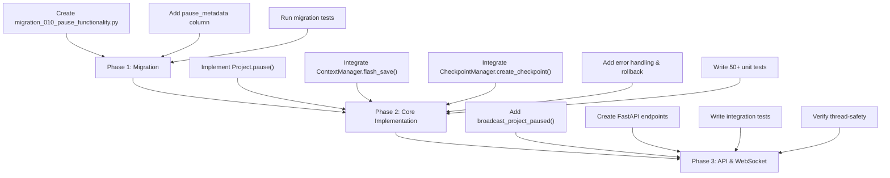

# Project.pause() Implementation - Quick Reference

## Key Findings

### 1. **Project.pause() Should Be SYNCHRONOUS** (Not Async)
- `Project.start()` and `Project.resume()` are both synchronous methods
- Database operations use `self.db.conn.cursor()` (synchronous SQLite)
- WebSocket broadcasting can be handled by API routes (async wrappers)

### 2. **Integration Flow**

```
Project.pause(reason="user_request")
    ↓
1. Validate prerequisites (_get_validated_project_id)
    ↓
2. Save previous_status (for rollback)
    ↓
3. Trigger Flash Save (ContextManager)
    - Checks if context exceeds threshold (144k tokens)
    - Archives COLD tier items
    - Returns: {checkpoint_id, tokens_before, tokens_after, reduction_percentage}
    ↓
4. Create Pause Checkpoint (CheckpointManager)
    - Git commit: "Checkpoint: Project paused"
    - DB backup: checkpoint-XXX-db.sqlite
    - Context snapshot: checkpoint-XXX-context.json
    - Metadata: tasks_completed, agents_active, costs
    ↓
5. Update Project Status in DB
    - db.update_project(project_id, {"status": "paused"})
    ↓
6. Store Pause Metadata
    - reason, checkpoint_id, timestamp
    ↓
7. Return Result Dict
    - success, checkpoint_id, tokens_before/after, reduction_percentage
    ↓
(Async API route will broadcast project_paused event via WebSocket)
```

### 3. **Method Signature**

```python
def pause(self, reason: Optional[str] = None) -> Dict[str, Any]:
    """Pause project execution.

    Returns: {
        "success": True,
        "checkpoint_id": 5,
        "tokens_before": 120000,
        "tokens_after": 45000,
        "reduction_percentage": 62.5,
        "items_archived": 150,
        "paused_at": "2025-11-23T14:30:00Z"
    }
    """
```

### 4. **Critical Code Locations**

| Task | File | Line Range |
|------|------|-----------|
| Pause stub | `codeframe/core/project.py` | 198-202 |
| Resume implementation (template) | `codeframe/core/project.py` | 204-258 |
| Start implementation (template) | `codeframe/core/project.py` | 125-196 |
| Flash save workflow | `codeframe/lib/context_manager.py` | 185-285 |
| Checkpoint creation | `codeframe/lib/checkpoint_manager.py` | 54-134 |
| Database update | `codeframe/persistence/database.py` | 1163-1195 |
| ProjectStatus enum | `codeframe/core/models.py` | 30-39 |

### 5. **Database Changes Required**

**Migration 010** should add:
```sql
-- Add pause metadata to projects table
ALTER TABLE projects ADD COLUMN pause_metadata JSON;

-- Add pause reason to checkpoints table
ALTER TABLE checkpoints ADD COLUMN pause_reason TEXT;
```

**No schema changes to existing tables** - just columns. Status enum already includes "paused".

### 6. **Flash Save Integration**

```python
from codeframe.lib.context_manager import ContextManager

context_mgr = ContextManager(db=self.db)

# Check if flash save needed (80% of 180k tokens = 144k threshold)
if context_mgr.should_flash_save(project_id, agent_id="orchestrator"):
    result = context_mgr.flash_save(project_id, agent_id="orchestrator")
    # result has: checkpoint_id, tokens_before, tokens_after, reduction_percentage
```

### 7. **Checkpoint Integration**

```python
from codeframe.lib.checkpoint_manager import CheckpointManager

checkpoint_mgr = CheckpointManager(
    db=self.db,
    project_root=self.project_dir,
    project_id=project_id
)

checkpoint = checkpoint_mgr.create_checkpoint(
    name="Project paused",
    description=f"Paused: {reason}",
    trigger="pause"
)
# Returns: Checkpoint(id, name, git_commit, paths, metadata)
```

### 8. **Error Handling Pattern**

```python
previous_status = self._status

try:
    # All operations
    self._status = ProjectStatus.PAUSED
    self.db.update_project(project_id, {"status": self._status.value})
    return result

except Exception as e:
    logger.error(f"Failed to pause project: {e}", exc_info=True)
    try:
        # Rollback
        self._status = previous_status
        if 'project_id' in locals():
            self.db.update_project(project_id, {"status": previous_status.value})
    except Exception as rollback_err:
        logger.error(f"Failed to rollback: {rollback_err}")
    raise
```

### 9. **WebSocket Broadcasting** (Optional - Can be done in API layer)

```python
# In codeframe/ui/websocket_broadcasts.py
async def broadcast_project_paused(
    manager,
    project_id: int,
    reason: Optional[str] = None,
    checkpoint_id: Optional[int] = None,
    tokens_archived: int = 0,
) -> None:
    message = {
        "type": "project_paused",
        "project_id": project_id,
        "reason": reason,
        "checkpoint_id": checkpoint_id,
        "tokens_archived": tokens_archived,
        "timestamp": datetime.now(UTC).isoformat().replace("+00:00", "Z"),
    }
    try:
        await manager.broadcast(message)
    except Exception as e:
        logger.error(f"Failed to broadcast: {e}")
        # Don't fail pause operation if broadcast fails
```

### 10. **Testing Requirements**

Target: **70+ tests** covering:

**Unit Tests** (~50 tests):
- [ ] Pause with no context → checkpoint created
- [ ] Pause with context → flash save triggered
- [ ] Pause already-paused project → error
- [ ] Pause with invalid project_id → error
- [ ] Rollback on checkpoint failure
- [ ] Database status updated correctly
- [ ] Pause metadata stored correctly

**Integration Tests** (~20 tests):
- [ ] Full pause workflow end-to-end
- [ ] Flash save integration
- [ ] Checkpoint creation during pause
- [ ] WebSocket broadcast during pause
- [ ] Resume after pause

### 11. **Three-Phase Implementation Plan**

**Phase 1: Database Schema** (1-2 hours)
- Create migration_010_pause_functionality.py
- Add pause_metadata column to projects
- Add pause_reason column to checkpoints
- Run tests to verify migration

**Phase 2: Core Implementation** (3-4 hours)
- Implement Project.pause() method
- Integrate flash save
- Integrate checkpoint creation
- Implement error handling & rollback
- Add comprehensive logging

**Phase 3: API & WebSocket** (2-3 hours)
- Add broadcast_project_paused() function
- Create FastAPI endpoints
- Write integration tests
- Verify thread-safety

### 12. **Key Differences from resume()**

| Aspect | resume() | pause() |
|--------|----------|---------|
| Flash save | No | **Yes** (context archival) |
| Checkpoint purpose | Restore from | Create for safety |
| Direction | Moving forward | Holding state |
| Context archival | No | **Yes** (archive COLD tier) |
| Next status | ACTIVE | PAUSED |

### 13. **ProjectStatus Valid Transitions**

```
    ┌─→ PLANNING → ACTIVE ──┐
    │                       ↓
   INIT                     PAUSED ←─┐
                                    │
                            STOPPED ┘
```

- INIT → PLANNING → ACTIVE → PAUSED (new path)
- ACTIVE ↔ PAUSED (pause/resume)
- PAUSED → STOPPED (agent termination)
- Any → COMPLETED (final state)

---

## Implementation Roadmap



---

## Files to Modify

1. **Create**: `codeframe/persistence/migrations/migration_010_pause_functionality.py`
2. **Modify**: `codeframe/core/project.py` (lines 198-202)
3. **Modify**: `codeframe/persistence/migrations/__init__.py` (register migration)
4. **Create/Modify**: `codeframe/ui/websocket_broadcasts.py` (add broadcast function)
5. **Create/Modify**: `codeframe/ui/routes/projects.py` (add pause endpoint)
6. **Create**: Test files for pause functionality

---

## Success Criteria

- ✓ Project.pause() method implemented and working
- ✓ Flash save triggered for context archival
- ✓ Pause checkpoint created with full state backup
- ✓ Project status updated to PAUSED
- ✓ Error handling with automatic rollback
- ✓ 70+ tests with 100% pass rate
- ✓ Coverage >85% for pause code
- ✓ WebSocket broadcasting for pause events
- ✓ API endpoints for pause/resume
- ✓ Documentation updated

---

## Notes for Implementation

1. **No async keyword**: Project.pause() should be synchronous, matching Project.start() and Project.resume()
2. **Flash save is mandatory**: Always archive COLD tier context when pausing
3. **Checkpoint trigger type**: Use `trigger="pause"` to distinguish pause checkpoints
4. **Logging is critical**: DEBUG logs for each step, INFO for major operations, ERROR for failures
5. **Rollback strategy**: Always save previous_status before changes, use try/except with nested exception handling
6. **Thread safety**: If pause is called from async route, use `asyncio.to_thread()` wrapper
7. **WebSocket is optional**: Can be added in Phase 3 without affecting core pause functionality

---

See **PAUSE_IMPLEMENTATION_ANALYSIS.md** for complete technical details, method signatures, code examples, and integration patterns.
