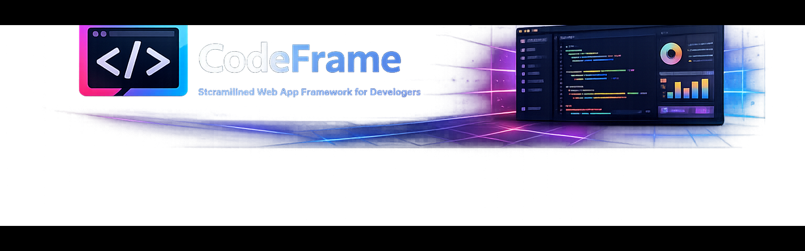

# CodeFRAME


[](https://x.com/FrankBria18044)

> AI coding agents that work autonomously while you sleep. Check in like a coworker, answer questions when needed, ship features continuously.

---

## Overview

CodeFRAME is an autonomous AI development system where specialized agents collaborate to build software features end-to-end. It combines multi-agent orchestration, human-in-the-loop blockers, and intelligent context management to enable truly autonomous software development cycles.

Unlike traditional AI coding assistants that wait for your prompts, CodeFRAME agents work independently on tasks, ask questions when blocked, and coordinate with each other to ship complete features—day and night.

**Two modes of operation:**
- **CLI-first (v2)** — Complete Golden Path workflow from the command line, no server required
- **Dashboard (v1)** — Real-time web UI with WebSocket updates for monitoring and interaction

---

## What's New (Updated: 2026-02-03)

### Phase 2: Server Layer In Progress

Phase 1 is complete! We're now building the server layer as a thin adapter over the CLI-first core:

| Feature | Status | Issue |
|---------|--------|-------|
| API key authentication for CLI & REST | ✅ Complete | #326 |
| Rate limiting with slowapi | ✅ Complete | #327 |
| Server audit & v2 routes | ✅ Complete | #322 |
| Real-time events (SSE) | ✅ Complete | #328 |
| OpenAPI documentation | ✅ Complete | #119 |

### API Key Authentication

**Programmatic access to CodeFRAME APIs** with scope-based permissions.

```bash
# Create an API key
cf auth api-key-create --name "CI Pipeline" --user-id 1

# List your API keys
cf auth api-key-list --user-id 1

# Revoke a key
cf auth api-key-revoke <key-id> --user-id 1 --yes

# Rotate a key (generates new key, same permissions)
cf auth api-key-rotate <key-id> --user-id 1
```

Use API keys via header: `X-API-Key: your_key_here`

**Scopes**: `read` (GET operations), `write` (create/update/delete), `admin` (full access)

### Rate Limiting

**Configurable rate limits** to prevent abuse and ensure fair usage:

```bash
# Configure via environment variables
RATE_LIMIT_ENABLED=true
RATE_LIMIT_AUTH=10/minute      # Auth endpoints
RATE_LIMIT_STANDARD=100/minute # Standard API calls
RATE_LIMIT_AI=20/minute        # AI/chat operations
RATE_LIMIT_WEBSOCKET=30/minute # WebSocket connections
```

Supports Redis backend for distributed deployments: `RATE_LIMIT_STORAGE=redis`

### OpenAPI Documentation

**Complete API documentation** available via Swagger UI and ReDoc.

- **Swagger UI**: `http://localhost:8080/docs` — Interactive API explorer
- **ReDoc**: `http://localhost:8080/redoc` — Clean API reference
- **OpenAPI JSON**: `http://localhost:8080/openapi.json` — Schema export

All endpoints include:
- Response models with examples
- Error response documentation (401, 403, 404, 409, 500)
- Query parameter descriptions
- Authentication requirements

---

### Phase 1 Complete 🎉 (2026-02-01)

<details>
<summary>Interactive PRD Generation</summary>

**`cf prd generate`** — AI-guided requirements discovery using Socratic questioning.

```bash
# Start interactive PRD creation
cf prd generate

# Non-interactive with initial description
cf prd generate --description "User authentication system with OAuth"

# Use specific template
cf prd generate --template lean
cf prd generate --template enterprise
```

The AI conducts 5+ turn discovery sessions, progressively refining from broad vision → specific requirements → acceptance criteria.

</details>

<details>
<summary>PRD Template System</summary>

**Customizable PRD output formats** for different team needs:

```bash
# List available templates
cf prd templates list

# Show template structure
cf prd templates show standard

# Export template for customization
cf prd templates export enterprise ./my-template.yaml

# Import custom template
cf prd templates import ./my-template.yaml
```

**Built-in templates:**
- `standard` - Balanced PRD with all essential sections
- `lean` - Minimal viable PRD for rapid iteration
- `enterprise` - Comprehensive PRD with compliance sections
- `technical` - Developer-focused with architecture details
- `user-story` - Agile/Scrum format with user stories

</details>

<details>
<summary>Live Execution Streaming</summary>

**`cf work follow`** — Watch agent execution in real-time.

```bash
# Stream live output from a running task
cf work follow <task-id>

# Show last 50 lines then continue streaming
cf work follow <task-id> --tail 50
```

</details>

---

### Previous Updates

<details>
<summary>Environment Validation & Tool Detection (2026-01-29)</summary>

**New `cf env` commands** — Validate your development environment and auto-install missing tools.

```bash
# Quick environment health check
cf env check

# Comprehensive diagnostics
cf env doctor

# Install a specific missing tool
cf env install-missing pytest

# Auto-install all missing required tools
cf env auto-install --yes
```

**Supported tool ecosystems:**
- Python: pytest, ruff, mypy, black, flake8, coverage, pre-commit
- JavaScript/TypeScript: eslint, prettier, jest, typescript, vite, vitest
- Rust: clippy, rustfmt, rust-analyzer, cargo-edit
- System: git, docker, make, curl, gh

</details>

<details>
<summary>GitHub PR Workflow Commands (2026-01-29)</summary>

**New `cf pr` commands** — Manage pull requests directly from the CLI.

```bash
# Create a PR from current branch
cf pr create --title "Add feature X" --body "Description..."

# List open PRs
cf pr list

# View PR details
cf pr view 123

# Merge a PR
cf pr merge 123 --method squash

# Close a PR
cf pr close 123
```

</details>

<details>
<summary>Task Self-Diagnosis (2026-01-29)</summary>

**New `cf work diagnose` command** — Automatically analyze failed tasks and get actionable recommendations.

```bash
# Diagnose why a task failed
cf work diagnose <task-id>

# Verbose output with detailed logs
cf work diagnose <task-id> --verbose
```

The diagnostic agent analyzes run logs, identifies root causes, and provides specific fix recommendations.

</details>

<details>
<summary>Task Scheduling & Templates (2026-01-25)</summary>

**Task Scheduling with Critical Path Analysis:**

```bash
# Show task schedule with dependencies
cf schedule show

# Predict completion dates
cf schedule predict

# Identify bottleneck tasks
cf schedule bottlenecks
```

**Task Templates for Common Patterns:**

```bash
# List available templates
cf templates list

# Show template details
cf templates show api-endpoint

# Apply template to generate tasks
cf templates apply api-endpoint --name "User API"
```

**7 Built-in Templates:**
- `api-endpoint` - REST API endpoint with tests
- `react-component` - React component with tests
- `database-migration` - Schema migration with rollback
- `cli-command` - CLI command with help and tests
- `integration-test` - Integration test suite
- `bug-fix` - Bug investigation and fix workflow
- `feature-flag` - Feature flag implementation

**Effort Estimation:**
- Tasks now support `estimated_hours` field
- CPM-based scheduling calculates critical path
- Bottleneck detection identifies blocking tasks

</details>

<details>
<summary>Tech Stack Configuration (2026-01-16)</summary>

**Describe your tech stack** — Tell CodeFRAME what technologies your project uses during initialization.

```bash
# Auto-detect from project files (pyproject.toml, package.json, Cargo.toml, etc.)
cf init . --detect

# Provide explicit tech stack description
cf init . --tech-stack "Python 3.11 with FastAPI, uv, pytest"
cf init . --tech-stack "TypeScript monorepo with pnpm, Next.js frontend"
cf init . --tech-stack "Rust project using cargo"

# Interactive setup
cf init . --tech-stack-interactive
```

**Why this matters:** The agent uses your tech stack description to determine appropriate commands and patterns. Works with any stack — Python, TypeScript, Rust, Go, monorepos, or mixed environments.

</details>

<details>
<summary>Agent Self-Correction & Observability (2026-01-16)</summary>

**Verification self-correction loop** — Agent now automatically attempts to fix failing verification gates.

```bash
# Execute with verbose output to see self-correction progress
cf work start <task-id> --execute --verbose

# Watch the agent attempt fixes in real-time
[VERIFY] Running final verification (attempt 1/3)
[VERIFY] Gates failed: pytest, ruff
[SELFCORRECT] Attempting to fix verification failures
[SELFCORRECT] Applied 2/2 fixes, re-verifying...
```

**Capabilities:**
- **Self-Correction Loop** — Agent analyzes gate errors and generates fix plans using LLM
- **Verbose Mode** — `--verbose` / `-v` flag shows detailed verification and self-correction progress
- **FAILED Task Status** — Tasks can now transition to FAILED state for proper error visibility
- **Project Preferences** — Agent loads AGENTS.md or CLAUDE.md for per-project configuration

</details>

<details>
<summary>Parallel Batch Execution (2026-01-15)</summary>

**Multi-task batch execution** — Run multiple tasks with intelligent parallelization.

```bash
# Execute multiple tasks in parallel
cf work batch run task1 task2 task3 --strategy parallel

# Execute all READY tasks with LLM-inferred dependencies
cf work batch run --all-ready --strategy auto

# Automatic retry on failure
cf work batch run --all-ready --retry 3
```

**Batch Capabilities:**
- **Parallel Execution** — ThreadPoolExecutor-based concurrent task execution
- **Dependency Graph** — DAG-based task ordering with cycle detection
- **LLM Dependency Inference** — `--strategy auto` analyzes task descriptions to infer dependencies
- **Automatic Retry** — `--retry N` retries failed tasks up to N times
- **Batch Resume** — `cf work batch resume <batch-id>` re-runs failed/blocked tasks

</details>

---

## Key Features

### CLI-First Agent System (v2)
- **Autonomous Execution** — `cf work start --execute` runs the full agent loop
- **Self-Correction Loop** — Agent automatically fixes failing verification gates (up to 3 attempts)
- **Human-in-the-Loop Blockers** — Agents pause and ask questions when they need decisions
- **Verification Gates** — Automatic ruff/pytest/BUILD checks after changes
- **Live Streaming** — `cf work follow` for real-time execution output
- **Verbose Mode** — `--verbose` flag shows detailed progress and self-correction activity
- **Dry Run Mode** — Preview changes without applying them
- **State Persistence** — Resume work across sessions
- **Task Diagnosis** — Automatic root cause analysis for failed tasks
- **PRD Generation** — AI-guided requirements discovery with templates

### Multi-Agent Orchestration
- **Multi-Agent Orchestra** — Lead agent coordinates backend, frontend, test, and review specialists
- **Async/Await Architecture** — Non-blocking agent execution with true concurrency
- **Self-Correction Loops** — Agents automatically fix failing tests (up to 3 attempts)
- **WebSocket Agent Broadcasting** — Real-time agent status updates to all connected clients
- **Tactical Pattern Handling** — Automatic resolution of common file conflicts

### Quality & Review
- **AI Quality Enforcement** — Dual-layer quality system preventing test skipping and enforcing 85%+ coverage
- **Quality Gates** — Pre-completion checks block bad code (tests, types, coverage, review)
- **BUILD Gate** — Validates configuration errors before execution
- **Automated Code Review** — Security scanning, OWASP pattern detection, and complexity analysis
- **Lint Enforcement** — Multi-language linting with trend tracking and automatic fixes

### State & Context Management
- **Context-Aware Memory** — Tiered HOT/WARM/COLD memory system reduces token usage by 30-50%
- **Session Lifecycle** — Auto-save/restore work context across CLI restarts
- **Checkpoint & Recovery** — Git + DB snapshots enable project state rollback
- **Phase-Aware Components** — UI intelligently selects data sources based on project phase

### Security & API
- **API Key Authentication** — Scope-based programmatic access (read/write/admin)
- **Rate Limiting** — Configurable limits per endpoint type with Redis support
- **JWT Authentication** — Session-based auth for web dashboard

### Developer Experience
- **Real-time Dashboard** — WebSocket-powered UI with agent status, blockers, and progress tracking
- **Environment Validation** — `cf env check` validates tools and dependencies
- **PR Workflow** — `cf pr create/list/merge` for GitHub integration
- **Task Scheduling** — CPM-based critical path analysis
- **Task Templates** — 7 built-in templates for common development patterns
- **PRD Templates** — 5 built-in PRD formats for different team needs
- **Cost Tracking** — Real-time token usage and cost analytics per agent/task

---

## Architecture

```
┌─────────────────────────────────────────────────────────────┐
│                    CLI / Agent Orchestrator                  │
│  • cf work start --execute                                   │
│  • Context loading → Planning → Execution → Verification    │
│  • Blocker detection and human-in-loop                      │
└─────────────┬──────────────┬──────────────┬────────────┬────┘
              │              │              │            │
      ┌───────▼───┐   ┌──────▼──────┐  ┌───▼────────┐  ┌▼────────┐
      │ Backend   │   │  Frontend   │  │    Test    │  │ Review  │
      │ Worker    │   │  Worker     │  │   Worker   │  │ Worker  │
      │ (async)   │   │  (async)    │  │  (async)   │  │ (async) │
      └─────┬─────┘   └──────┬──────┘  └─────┬──────┘  └────┬────┘
            │                │               │              │
            │  ┌─────────────▼───────────────▼──────────────▼─────┐
            │  │         Blocker Management (Sync/Async)           │
            │  │  • Database-backed queue (SQLite)                 │
            │  │  • Human-in-the-loop questions                    │
            │  └───────────────────────────────────────────────────┘
            │
    ┌───────▼──────────────────────────────────────────────────┐
    │              Context Management Layer                     │
    │  • Tiered memory (HOT/WARM/COLD)                         │
    │  • Importance scoring & tier assignment                   │
    │  • Flash save mechanism                                   │
    └──────────────────────────────────────────────────────────┘
```

---

## Quick Start

### Prerequisites
- Python 3.11+
- Node.js 18+ (for frontend, optional)
- Anthropic API key
- SQLite 3 (included with Python)

### Installation

```bash
# Clone repository
git clone https://github.com/frankbria/codeframe.git
cd codeframe

# Install uv package manager
curl -LsSf https://astral.sh/uv/install.sh | sh

# Set up backend
uv venv
source .venv/bin/activate  # On Windows: .venv\Scripts\activate
uv sync

# Set up environment
export ANTHROPIC_API_KEY="your-api-key-here"

# Validate environment (optional but recommended)
cf env check
```

### CLI-First Workflow (v2 — Recommended)

```bash
# 1. Initialize workspace (with optional tech stack detection)
cd /path/to/your/project
cf init . --detect
# Or explicit: cf init . --tech-stack "Python with FastAPI, uv, pytest"

# 2. Generate PRD interactively (NEW!)
cf prd generate
# Or add existing PRD file
cf prd add requirements.md

# 3. Generate tasks from PRD
cf tasks generate

# 4. List tasks
cf tasks list

# 5. Start work on a task (with AI agent)
cf work start <task-id> --execute

# 6. Follow execution in real-time (NEW!)
cf work follow <task-id>

# 7. Check for blockers (questions the agent needs answered)
cf blocker list
cf blocker answer <blocker-id> "Your answer here"

# 8. Resume work after answering blockers
cf work resume <task-id>

# 9. If a task fails, diagnose the issue
cf work diagnose <task-id>

# 10. Review changes and create checkpoint
cf review
cf checkpoint create "Feature complete"
```

### Dashboard Mode (v1)

```bash
# Start the dashboard (from project root)
codeframe serve

# Or manually start backend and frontend separately:
# Terminal 1: Backend
uv run uvicorn codeframe.ui.server:app --reload --port 8080

# Terminal 2: Frontend
cd web-ui && npm install && npm run dev

# Access dashboard at http://localhost:3000
```

---

## CLI Commands

### Workspace Management
```bash
cf init <path>                           # Initialize workspace for a repo
cf init <path> --detect                  # Initialize + auto-detect tech stack
cf init <path> --tech-stack "description"  # Initialize + explicit tech stack
cf init <path> --tech-stack-interactive  # Initialize + interactive setup
cf status                                # Show workspace status
```

### Environment Validation
```bash
cf env check                    # Quick environment health check
cf env doctor                   # Comprehensive diagnostics
cf env install-missing <tool>   # Install specific missing tool
cf env auto-install --yes       # Install all missing tools
```

### Authentication & API Keys
```bash
cf auth setup --provider anthropic       # Configure API credentials
cf auth list                             # List configured credentials
cf auth validate anthropic               # Test credential validity
cf auth api-key-create -n "Key Name" -u 1  # Create API key
cf auth api-key-list -u 1                # List your API keys
cf auth api-key-revoke <id> -u 1 --yes   # Revoke an API key
cf auth api-key-rotate <id> -u 1         # Rotate an API key
```

### PRD (Product Requirements)
```bash
cf prd generate                 # Interactive AI-guided PRD creation (NEW!)
cf prd generate --template lean # Use specific template
cf prd add <file.md>            # Add/update PRD from file
cf prd show                     # Display current PRD
cf prd list                     # List all PRDs
cf prd versions <id>            # Show version history
cf prd diff <id> <v1> <v2>      # Compare versions
```

### PRD Templates
```bash
cf prd templates list           # List available templates
cf prd templates show <id>      # Show template structure
cf prd templates export <id> <path>  # Export template to file
cf prd templates import <path>  # Import custom template
```

### Task Management
```bash
cf tasks generate           # Generate tasks from PRD (uses LLM)
cf tasks list               # List all tasks
cf tasks list --status READY  # Filter by status
cf tasks show <id>          # Show task details
```

### Task Scheduling
```bash
cf schedule show            # Show task schedule with dependencies
cf schedule predict         # Predict completion dates
cf schedule bottlenecks     # Identify blocking tasks
```

### Task Templates
```bash
cf templates list           # List available templates
cf templates show <name>    # Show template details
cf templates apply <name>   # Generate tasks from template
```

### Work Execution
```bash
cf work start <id>          # Start work (creates run record)
cf work start <id> --execute     # Start with AI agent execution
cf work start <id> --execute --verbose  # Execute with detailed output
cf work start <id> --execute --dry-run  # Preview changes only
cf work stop <id>           # Stop current run
cf work resume <id>         # Resume blocked work
cf work follow <id>         # Stream real-time output (NEW!)
cf work follow <id> --tail 50  # Show last N lines then stream
cf work diagnose <id>       # Diagnose failed task
```

### Batch Execution
```bash
cf work batch run <id1> <id2> ...     # Execute multiple tasks
cf work batch run --all-ready         # Execute all READY tasks
cf work batch run --strategy parallel # Parallel execution
cf work batch run --strategy auto     # LLM-inferred dependencies
cf work batch run --retry 3           # Auto-retry failed tasks
cf work batch status [batch_id]       # Show batch status
cf work batch cancel <batch_id>       # Cancel running batch
cf work batch resume <batch_id>       # Re-run failed tasks
```

### Blockers
```bash
cf blocker list             # List open blockers
cf blocker show <id>        # Show blocker details
cf blocker answer <id> "answer"  # Answer a blocker
```

### Pull Requests
```bash
cf pr create --title "..." --body "..."  # Create PR
cf pr list                               # List open PRs
cf pr view <number>                      # View PR details
cf pr merge <number> --method squash     # Merge PR
cf pr close <number>                     # Close PR
```

### Quality & Review
```bash
cf review                   # Run verification gates
cf patch export             # Export changes as patch
cf commit                   # Commit changes
```

### Checkpoints
```bash
cf checkpoint create <name>  # Create checkpoint
cf checkpoint list          # List checkpoints
cf checkpoint restore <id>  # Restore to checkpoint
cf summary                  # Show session summary
```

---

## Configuration

### Environment Variables

```bash
# Required
ANTHROPIC_API_KEY=sk-ant-...           # Anthropic API key

# Optional - Database
DATABASE_PATH=./codeframe.db           # SQLite database path (default: in-memory)

# Optional - Quality Enforcement
MIN_COVERAGE_PERCENT=85                # Minimum test coverage required
CODEFRAME_ENABLE_SKIP_DETECTION=true   # Enable skip detection gate (default: true)

# Optional - Git Integration
AUTO_COMMIT_ENABLED=true               # Enable automatic commits after test passes

# Optional - Notifications
NOTIFICATION_DESKTOP_ENABLED=true      # Enable desktop notifications
NOTIFICATION_WEBHOOK_URL=https://...   # Webhook endpoint for agent events

# Optional - Rate Limiting
RATE_LIMIT_ENABLED=true                # Enable rate limiting (default: true)
RATE_LIMIT_AUTH=10/minute              # Auth endpoints
RATE_LIMIT_STANDARD=100/minute         # Standard API endpoints
RATE_LIMIT_AI=20/minute                # AI/chat operations
RATE_LIMIT_STORAGE=memory              # memory or redis

# Frontend (set at build time for Next.js)
NEXT_PUBLIC_API_URL=http://localhost:8080
NEXT_PUBLIC_WS_URL=ws://localhost:8080/ws
```

### Project Configuration

See `CLAUDE.md` in project root for project-specific configuration including:
- Active technologies and frameworks
- Coding standards and conventions
- Testing requirements
- Documentation structure

---

## API Documentation

### Core Endpoints

```
POST   /api/projects                          # Create project
GET    /api/projects/{id}                     # Get project details
POST   /api/projects/{id}/prd                 # Submit PRD

GET    /api/projects/{id}/agents              # List agents
POST   /api/projects/{id}/agents              # Create agent

GET    /api/projects/{id}/blockers            # List blockers
POST   /api/blockers/{id}/answer              # Answer blocker

GET    /api/projects/{id}/tasks               # List tasks
GET    /api/tasks/{id}                        # Get task details
POST   /api/tasks/approve                     # Approve tasks for development

GET    /api/schedule/{project_id}             # Get task schedule
GET    /api/templates                         # List task templates
POST   /api/templates/{name}/apply            # Apply template
```

### V2 API Endpoints (Phase 2)

```
# Tasks
GET    /api/v2/tasks                          # List tasks with filtering
GET    /api/v2/tasks/{id}                     # Get task details
POST   /api/v2/tasks                          # Create task
PATCH  /api/v2/tasks/{id}                     # Update task
DELETE /api/v2/tasks/{id}                     # Delete task
GET    /api/v2/tasks/{id}/stream              # SSE streaming

# PRD
GET    /api/v2/prd                            # List PRDs
POST   /api/v2/prd                            # Create PRD
GET    /api/v2/prd/{id}/versions              # Version history

# Blockers
GET    /api/v2/blockers                       # List blockers
POST   /api/v2/blockers/{id}/answer           # Answer blocker
```

### Authentication

```
# Session-based (JWT)
POST   /api/auth/login                        # Login, get JWT
POST   /api/auth/register                     # Register new user
GET    /api/auth/me                           # Current user info

# API Key
Header: X-API-Key: your_key_here              # Include in all requests
```

### WebSocket

```
WS     /ws?token=JWT_TOKEN                    # WebSocket connection (auth required)
```

For detailed API documentation, see `/docs` (Swagger UI) or `/redoc` (ReDoc) when the server is running.

---

## Testing

### Run Tests

```bash
# Run all unit tests
uv run pytest

# Run specific test suite
uv run pytest tests/core/           # Core module tests
uv run pytest tests/agents/         # Agent tests
uv run pytest tests/api/            # API endpoint tests
uv run pytest tests/cli/            # CLI command tests

# Run with coverage
uv run pytest --cov=codeframe --cov-report=html

# Run v2 tests only
uv run pytest -m v2
```

### Test Statistics

- **Total Tests**: 4285+
  - Core module tests: ~1200
  - Unit tests: ~1500 (Python + TypeScript)
  - Integration tests: ~1000
  - E2E tests: 100+ (Backend + Playwright)
- **Coverage**: 88%+
- **Pass Rate**: 100%

---

## Documentation

For detailed documentation, see:

- **Strategic Roadmap**: [docs/V2_STRATEGIC_ROADMAP.md](docs/V2_STRATEGIC_ROADMAP.md) - 5-phase development plan
- **Quick Start (v2)**: [docs/QUICKSTART.md](docs/QUICKSTART.md) - Get started in 5 minutes
- **Golden Path (v2)**: [docs/GOLDEN_PATH.md](docs/GOLDEN_PATH.md) - CLI-first workflow contract
- **Agent Implementation**: [docs/AGENT_IMPLEMENTATION_TASKS.md](docs/AGENT_IMPLEMENTATION_TASKS.md) - Agent system details
- **CLI Wireframe**: [docs/CLI_WIREFRAME.md](docs/CLI_WIREFRAME.md) - Command structure
- **CLI Test Report**: [docs/CLI_V2_TEST_REPORT.md](docs/CLI_V2_TEST_REPORT.md) - End-to-end test results
- **Phase 2 Developer Guide**: [docs/PHASE_2_DEVELOPER_GUIDE.md](docs/PHASE_2_DEVELOPER_GUIDE.md) - Server layer patterns
- **Product Requirements**: [PRD.md](PRD.md)
- **System Architecture**: [CODEFRAME_SPEC.md](CODEFRAME_SPEC.md)
- **Sprint Planning**: [SPRINTS.md](SPRINTS.md)
- **Agent Guide**: [AGENTS.md](AGENTS.md)

---

## Contributing

We welcome contributions! To get started:

1. **Fork and clone** the repository
2. **Install dependencies**: `uv sync`
3. **Install pre-commit hooks**: `pre-commit install`
4. **Run tests** to ensure everything works: `uv run pytest`

### Code Standards

- **Python**: Follow PEP 8, use `ruff` for linting
- **TypeScript**: Follow ESLint rules, use Prettier for formatting
- **Type Hints**: Required for all Python functions
- **Tests**: Required for all new features (85%+ coverage)
- **Documentation**: Update README and docstrings for API changes

### Pull Request Process

1. Create a feature branch: `git checkout -b feature/my-feature`
2. Write tests first (TDD approach encouraged)
3. Implement feature with proper error handling
4. Ensure all tests pass: `uv run pytest`
5. Run quality checks: `uv run ruff check .`
6. Update documentation if needed
7. Submit PR with clear description of changes

---

## Roadmap

### Completed
- **Phase 0**: CLI-first Golden Path workflow
- **Phase 1**: CLI Foundation ✅
  - Interactive PRD generation with Socratic discovery
  - Live execution streaming (`cf work follow`)
  - PRD template system
  - Integration tests for credentials/environment
  - Batch execution (serial, parallel, auto strategies)
  - Self-correction loop for verification failures
  - Task scheduling with CPM analysis
  - Task templates (7 built-in)
  - Environment validation and tool detection
  - GitHub PR workflow commands
  - Task self-diagnosis system

### In Progress (Phase 2: Server Layer)
- **Server audit and refactor** (#322) — Routes delegating to core modules ✅
- **Real-time events** (#328) — SSE streaming for task execution ✅
- **API key authentication** (#326) — Programmatic API access ✅
- **Rate limiting** (#327) — Security and abuse prevention ✅
- **OpenAPI documentation** (#119) — Complete API docs with examples ✅

### Planned (Phases 3-5)
- **Phase 3**: Web UI rebuild on v2 foundation
- **Phase 4**: Multi-agent coordination (agent roles, conflict resolution, handoffs)
- **Phase 5**: Advanced features (TUI dashboard, token/cost tracking, debug/replay mode)

See [docs/V2_STRATEGIC_ROADMAP.md](docs/V2_STRATEGIC_ROADMAP.md) for the complete roadmap.

---

## License

This project is licensed under the **GNU Affero General Public License v3.0 (AGPL-3.0)**.

Key points:
- **Open Source**: Free to use, modify, and distribute
- **Copyleft**: Derivative works must also be AGPL-3.0
- **Network Use**: If you run a modified version as a service, you must release source code
- **Commercial Use**: Permitted with AGPL-3.0 compliance

See [LICENSE](LICENSE) for full details.

---

## Credits & Acknowledgments

### Core Team
- **Frank Bria** - Creator and Lead Developer

### Technologies
- **Anthropic Claude** - AI reasoning engine powering all agents
- **FastAPI** - High-performance async web framework
- **FastAPI Users** - Authentication and user management
- **SlowAPI** - Rate limiting for FastAPI
- **React + TypeScript** - Modern frontend with real-time updates
- **SQLite** - Embedded database for persistence
- **Playwright** - End-to-end testing framework
- **pytest + jest** - Comprehensive testing frameworks

### Inspiration
Built on the principles of:
- Autonomous agent systems (AutoGPT, BabyAGI)
- Multi-agent orchestration (LangGraph, CrewAI)
- Human-in-the-loop design (Constitutional AI)
- Test-driven development (Kent Beck, Robert Martin)

---

## Support & Community

- **Issues**: [GitHub Issues](https://github.com/frankbria/codeframe/issues)
- **Discussions**: [GitHub Discussions](https://github.com/frankbria/codeframe/discussions)
- **Documentation**: [Full Documentation](https://github.com/frankbria/codeframe/tree/main/docs)

---

**Built with care by humans and AI agents working together**
