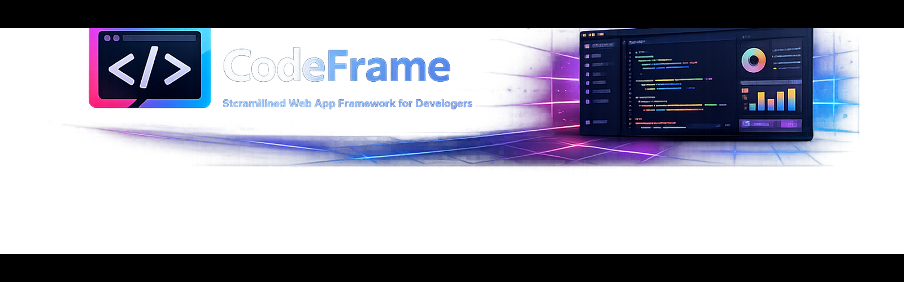

# CodeFRAME


[](https://github.com/frankbria/codeframe/actions/workflows/test.yml)

[](https://x.com/FrankBria18044)

> [!WARNING]
> **Prerequisite:** CodeFRAME requires an `ANTHROPIC_API_KEY` from [console.anthropic.com](https://console.anthropic.com/). Get your key before running any `cf` command.

---

> **The IDE of the future is not a better text editor with AI autocomplete. It is a project delivery system where writing code is a subprocess.**

---

## The Problem

Coding agents are getting remarkably good at writing code. But shipping software is not the same as writing code.

Before code gets written, someone has to figure out *what* to build, decompose it into tasks that an agent can execute, and resolve ambiguities. After code gets written, someone has to verify it actually works, catch regressions, and deploy with confidence. Today, that "someone" is still you.

CodeFRAME owns the **edges** of the pipeline -- everything that happens before and after the code gets written. The actual coding is delegated to frontier agents (Claude Code, Codex, OpenCode, Kilocode, or CodeFRAME's built-in ReAct agent) that are better at it than any custom agent could be.

## Think. Build. Prove. Ship.

```text
THINK    What are you building? How should it be broken down?
           cf prd generate         Socratic requirements gathering
           cf prd stress-test      Recursive decomposition, surface ambiguities
           cf tasks generate       Atomic tasks with dependency graphs

BUILD    Delegate to the best coding agent for the job
           cf work start --engine  Claude Code, Codex, OpenCode, Kilocode, or built-in
           CodeFRAME owns: verification gates, self-correction, stall detection

PROVE    Is the output any good?
           cf proof run            9-gate evidence-based quality system
           cf proof capture        Glitch becomes a permanent requirement
           cf proof list           All active proof obligations
           cf proof status         Summary across all gates
           cf proof show <id>      Requirement detail and evidence
           cf proof waive <id>     Waive a requirement with justification

SHIP     Deploy with confidence
           cf pr create            PR with proof report attached
           cf pr merge             Only merges if proof passes

THE CLOSED LOOP
  Glitch in production
    -> cf proof capture
    -> New requirement
    -> Enforced on every future build
    = Quality compounding interest
```

---

## Why CodeFRAME

**Nobody else does the full upstream pipeline.** Most orchestrators assume issues and specs already exist. CodeFRAME generates them through AI-guided Socratic discovery and recursive decomposition.

**Agent-agnostic execution.** CodeFRAME does not compete with Claude Code or Codex. It orchestrates them. The built-in ReAct agent is a capable fallback, not the point.

**Quality memory (PROOF9).** Every failure becomes a permanent proof obligation across 9 verification gates. Not just test coverage -- evidence-based verification that compounds over time. The closed loop is what turns a project into a learning system.

**Radical simplicity.** Single CLI binary, SQLite, no daemons, no infrastructure. Install and start building in under a minute.

---

## Quick Start

**Step 1 — Install**

```bash
git clone https://github.com/frankbria/codeframe.git && cd codeframe
curl -LsSf https://astral.sh/uv/install.sh | sh
uv venv && source .venv/bin/activate && uv sync
uv run cf --help   # smoke test — should print the command tree
```

**Step 2 — Set your API key**

```bash
export ANTHROPIC_API_KEY="sk-ant-..."   # get yours at https://console.anthropic.com/
```

**Step 3 — Initialize your project**

```bash
uv run cf init /path/to/your/project --detect
```

**Step 4 — Think: generate a PRD and tasks**

```bash
uv run cf prd generate          # AI-guided Socratic requirements discovery
uv run cf tasks generate        # Decompose PRD into atomic tasks with dependencies
uv run cf tasks list            # Review what was generated
```

**Step 5 — Build, Prove, and Ship**

```bash
uv run cf work batch run --all-ready   # Execute all READY tasks (delegates to agent)
uv run cf proof run                    # Run PROOF9 quality gates
uv run cf pr create                    # Open a PR with proof report attached
```

That is the entire workflow. Everything else is optional.

---

## Architecture

```
    YOU
     |
     v
  +-THINK---------------------------------------------+
  |  cf prd generate    Socratic requirements          |
  |  cf tasks generate  Atomic decomposition           |
  +----------------------------+-----------------------+
                               |
                               v
  +-BUILD---------------------------------------------+
  |  cf work start --engine <agent>                    |
  |                                                    |
  |  +-- Claude Code / Codex / OpenCode / Kilocode / ReAct        |
  |  |                                                 |
  |  +-- Verification gates (ruff, pytest, BUILD)      |
  |  +-- Self-correction loop (up to 5 retries)        |
  |  +-- Stall detection -> retry / blocker / fail       |
  +----------------------------+-----------------------+
                               |
                               v
  +-PROVE---------------------------------------------+
  |  cf proof run       9-gate quality system          |
  |  cf review          Verification gates             |
  +----------------------------+-----------------------+
                               |
                               v
  +-SHIP----------------------------------------------+
  |  cf pr create       PR with proof report           |
  |  cf pr merge        Merge if proof passes          |
  +---------------------------------------------------+
                               |
            Glitch in production?
                               |
                               v
            cf proof capture -> new requirement
            -> enforced forever (closed loop)
```

The core domain is headless and runs entirely from the CLI. The FastAPI server and web UI are optional adapters for teams that want a dashboard.

---

## CLI Reference

> All commands below assume the virtual environment is active (`source .venv/bin/activate`). If it is not active, prefix every `cf` command with `uv run` — e.g., `uv run cf init .`.

### THINK -- Requirements and Planning

```bash
# Workspace
cf init <path>                        # Initialize workspace
cf init <path> --detect               # Auto-detect tech stack
cf status                             # Workspace status

# Requirements
cf prd generate                       # AI-guided Socratic PRD creation
cf prd generate --template lean       # Use a specific template
cf prd add <file.md>                  # Import existing PRD
cf prd show                           # Display current PRD

# Task decomposition
cf tasks generate                     # Generate tasks from PRD (LLM-powered)
cf tasks list                         # List all tasks
cf tasks list --status READY          # Filter by status
cf tasks show <id>                    # Task details with dependencies

# Scheduling
cf schedule show                      # Task schedule with dependencies
cf schedule predict                   # Completion date estimates
cf schedule bottlenecks               # Identify blocking tasks
```

### BUILD -- Execution

```bash
# Single task
cf work start <id> --execute          # Execute with default engine (ReAct)
cf work start <id> --execute --engine plan   # Use legacy plan engine
cf work start <id> --execute --verbose       # Detailed progress output
cf work start <id> --execute --dry-run       # Preview without applying
cf work start <id> --execute --stall-timeout 120   # Custom stall timeout (seconds)
cf work start <id> --execute --stall-action retry  # Auto-retry on stall (blocker|retry|fail)
cf work follow <id>                   # Stream live output
cf work stop <id>                     # Cancel a run
cf work resume <id>                   # Resume after answering blockers

# Batch execution
cf work batch run --all-ready                # All READY tasks
cf work batch run --strategy parallel        # Parallel execution
cf work batch run --strategy auto            # LLM-inferred dependencies
cf work batch run --retry 3                  # Auto-retry failures
cf work batch status [batch_id]              # Batch progress
cf work batch resume <batch_id>              # Re-run failed tasks

# Blockers (human-in-the-loop)
cf blocker list                       # Questions the agent needs answered
cf blocker show <id>                  # Blocker details
cf blocker answer <id> "answer"       # Unblock the agent

# Diagnostics
cf work diagnose <id>                 # AI-powered failure analysis
cf env check                          # Validate environment
cf env doctor                         # Comprehensive health check
```

### PROVE -- Verification

```bash
# PROOF9 quality memory
cf proof run                          # Run all 9 proof gates
cf proof capture                      # Capture glitch as permanent requirement
cf proof list                         # List all proof requirements
cf proof status                       # Summary status across all gates
cf proof show <id>                    # Detail for a specific requirement
cf proof waive <id> --reason "..."    # Waive a requirement with justification

# Checkpoints and gates
cf review                             # Run verification gates
cf checkpoint create "milestone"      # Snapshot project state
cf checkpoint list                    # List checkpoints
cf checkpoint restore <id>            # Roll back to checkpoint

# Debugging
cf work replay <id>                   # Replay and debug a past execution
cf tui                                # Launch TUI dashboard
```

### SHIP -- Delivery

```bash
cf pr create                          # Create PR from current branch
cf pr status                          # PR status and review state
cf pr checks                          # CI check results
cf pr merge                           # Merge approved PR
cf commit                             # Commit verified changes
cf patch export                       # Export changes as patch
```

---

## What Works Today

CodeFRAME v2 (Phases 1–6 complete) delivers the full Think-Build-Prove-Ship loop:

- **THINK**: Socratic PRD generation with recursive stress-testing, LLM-powered task decomposition with dependency graphs, 5 PRD templates, 7 task templates, CPM-based scheduling
- **BUILD**: ReAct agent with 7 tools, self-correction with loop prevention, verification gates (ruff/pytest/BUILD), stall detection with configurable recovery (retry/blocker/fail), batch execution (serial/parallel/auto), human-in-the-loop blockers, checkpointing, state persistence, replay/debug mode (`cf work replay`), dynamic config reload, TUI dashboard (`cf tui`)
- **PROVE**: PROOF9 quality memory system — 9-gate evidence-based verification (`cf proof run/capture/list/status/show/waive`), every glitch becomes a permanent proof obligation
- **SHIP**: GitHub PR workflow, environment validation, task self-diagnosis
- **Engine adapters**: Claude Code, Codex, OpenCode, Kilocode, and built-in ReAct — all via `--engine` flag
- **Server layer** (optional): FastAPI with 16+ v2 routers, API key auth, rate limiting, SSE streaming, OpenAPI docs
- **Web UI**: Workspace view, PRD discovery, Task board, Blocker resolution, Review/commit, PROOF9 requirements and evidence views, TUI dashboard
- **Test suite**: 4200+ tests, 88% coverage

---

## Roadmap

### THINK (upstream pipeline)
- [x] `cf prd stress-test` -- Recursive decomposition that surfaces ambiguities before execution
- [x] Multi-round PRD refinement with domain-specific probes
- [ ] Specification-level dependency analysis

### BUILD (agent adapters)
- [x] Agent adapter architecture -- delegate to Claude Code, Codex, OpenCode, Kilocode via workspace hooks
- [x] Worktree isolation for parallel agent execution
- [x] Reconciliation layer for multi-agent output
- [x] Replay/debug mode (`cf work replay`)
- [x] TUI dashboard (`cf tui`)
- [x] Dynamic config reload during batch execution
- [ ] Engine performance tracking and automatic routing

### PROVE (quality memory)
- [x] PROOF9 -- 9-gate evidence-based quality system
- [x] `cf proof capture` -- Glitch-to-requirement closed loop
- [x] Quality compounding: every failure becomes a permanent proof obligation
- [ ] Per-engine quality scoring
- [ ] Proof report attached to PRs
- [ ] Merge gating on PROOF9 pass

### SHIP (delivery confidence)
- [ ] Unified configuration (`cf config`)
- [ ] Deployment hooks

### Web UI
- [x] Workspace and PRD views with Socratic discovery
- [x] Onboarding guidance card for new workspaces (Think→Build→Prove→Ship pipeline steps, dismissable per workspace)
- [x] Task board with Kanban and batch execution
- [x] Blocker Resolution view
- [x] Review and Commit view with diff viewer
- [x] PROOF9 requirements list, detail, and evidence history
- [ ] Execution Monitor view

---

## Configuration

```bash
# Required
export ANTHROPIC_API_KEY=sk-ant-...

# Optional
export DATABASE_PATH=./codeframe.db         # Default: in-memory SQLite
export RATE_LIMIT_ENABLED=true              # API rate limiting
export RATE_LIMIT_DEFAULT=100/minute        # Default limit
```

For server configuration, rate limiting options, and API key setup, see [docs/PHASE_2_DEVELOPER_GUIDE.md](docs/PHASE_2_DEVELOPER_GUIDE.md).

---

## Testing

```bash
uv run pytest                          # All tests
uv run pytest -m v2                    # v2 tests only
uv run pytest tests/core/             # Core module tests
uv run pytest --cov=codeframe --cov-report=html   # With coverage
```

---

## Documentation

- [Golden Path](docs/GOLDEN_PATH.md) -- The CLI-first workflow contract
- [Strategic Roadmap](docs/V2_STRATEGIC_ROADMAP.md) -- 5-phase development plan
- [CLI Wireframe](docs/CLI_WIREFRAME.md) -- Command-to-module mapping
- [ReAct Agent Architecture](docs/REACT_AGENT_ARCHITECTURE.md) -- Tools, editor, token management
- [Phase 2 Developer Guide](docs/PHASE_2_DEVELOPER_GUIDE.md) -- Server layer patterns
- [Phase 3 UI Architecture](docs/PHASE_3_UI_ARCHITECTURE.md) -- Web UI information design

---

## Contributing

1. Fork and clone the repository
2. Install dependencies: `uv sync`
3. Install pre-commit hooks: `pre-commit install`
4. Run tests: `uv run pytest`
5. Submit PR with tests and clear description

Code standards: PEP 8, `ruff` for linting, type hints required, 85%+ test coverage.

---

## License

[AGPL-3.0](LICENSE) -- Free to use, modify, and distribute. Derivative works and network services must release source code under the same license.

---

**Built by [Frank Bria](https://x.com/FrankBria18044)**

[Issues](https://github.com/frankbria/codeframe/issues) | [Discussions](https://github.com/frankbria/codeframe/discussions) | [Documentation](https://github.com/frankbria/codeframe/tree/main/docs)
