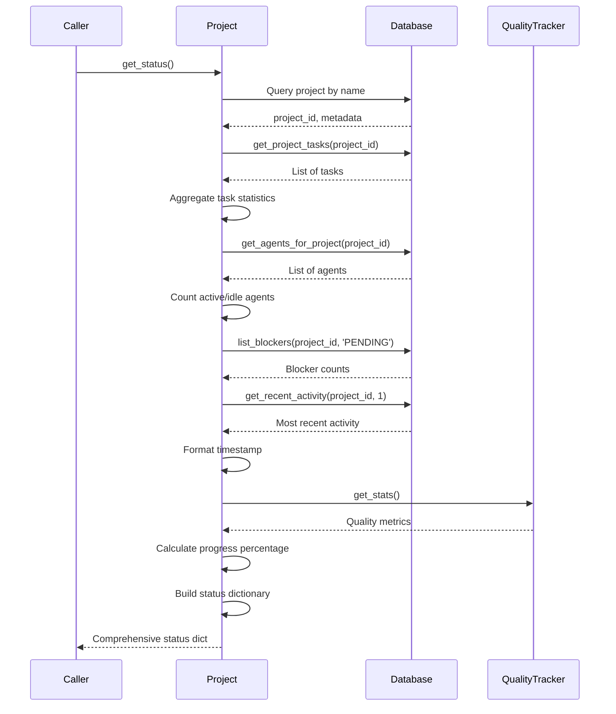

# Implementation Session: Comprehensive Project.get_status() Method

**Date**: 2025-12-18
**Feature Branch**: `feature/project-get-status-implementation`
**Orchestrator Agent ID**: add716d

---

## Objective

Implement comprehensive database-backed `Project.get_status()` method to return real-time project state including task statistics, agent counts, progress metrics, quality data, and activity timestamps.

---

## Current State

The `Project.get_status()` method in `codeframe/core/project.py` (lines 130-139) currently returns minimal hardcoded data. The codebase has comprehensive database methods available but they are not being utilized.

---

## Implementation Plan

### Phase 1: Database Schema Analysis (Sequential)

**Goal**: Understand existing database schema and available query methods

**Tasks**:
- Read `codeframe/persistence/database.py` for available query methods
- Read `codeframe/core/models.py` for TaskStatus enum and data models
- Read current `codeframe/core/project.py` implementation
- Document database methods: `get_project_tasks()`, `get_agents_for_project()`, `list_blockers()`, `get_recent_activity()`
- Document TaskStatus enum values and usage patterns

**Expected Outcome**: Complete understanding of database schema and available query methods

**Estimated tokens**: ~3k

---

### Phase 2: Core Implementation (Sequential)

**Goal**: Build the database-backed `get_status()` method with all required data aggregations

**Implementation Steps**:

1. **Retrieve Project ID from Database**
   - Query: `SELECT id, name, status, created_at FROM projects WHERE name = ?`
   - Use project name from `self.config.load().project_name`
   - Handle missing project (return minimal status with warning)
   - Store project ID for subsequent queries

2. **Query Task Statistics**
   - Call `self.db.get_project_tasks(project_id)`
   - Count tasks by status: `total`, `completed`, `in_progress`, `blocked`, `pending` (PENDING + ASSIGNED)
   - Include FAILED tasks in total count

3. **Query Agent Information**
   - Call `self.db.get_agents_for_project(project_id, active_only=True)`
   - Count agents by status:
     - `active`: agents with active status or `current_task_id` not null
     - `idle`: agents with idle status or `current_task_id` null
     - `total`: total count of all agents
   - Handle case with no agents (all counts = 0)

4. **Calculate Progress Percentage**
   - Formula: `progress_pct = (completed_tasks / total_tasks * 100)` if `total_tasks > 0`, else `0.0`
   - Round to 1 decimal place

5. **Count Active Blockers**
   - Call `self.db.list_blockers(project_id, status='PENDING')`
   - Extract `pending_count` from returned dictionary

6. **Retrieve Quality Metrics**
   - Initialize `QualityTracker` with `project_path=self.project_dir`
   - Call `tracker.get_stats()`
   - Extract `test_pass_rate` and `coverage_pct`
   - Handle missing quality data (return `None` or `0.0`)
   - Format: `{"test_pass_rate": float, "coverage_pct": float}`

7. **Format Last Activity Timestamp**
   - Call `self.db.get_recent_activity(project_id, limit=1)`
   - Extract timestamp field if activity exists
   - Create helper function similar to `_format_time_ago()` from `lead_agent.py` (lines 1553-1583)
   - Format: "X minutes ago", "X hours ago", "X days ago", "just now"
   - Return `"No activity yet"` if no activity

8. **Construct Status Dictionary**
   ```python
   {
       "id": project_id,
       "name": project_name,
       "status": self._status.value,
       "created_at": created_at_iso_string,
       "tasks": {
           "total": total_tasks,
           "completed": completed_tasks,
           "in_progress": in_progress_tasks,
           "blocked": blocked_tasks,
           "pending": pending_tasks
       },
       "agents": {
           "active": active_agents,
           "idle": idle_agents,
           "total": total_agents
       },
       "progress_pct": progress_percentage,
       "blockers": pending_blocker_count,
       "quality": {
           "test_pass_rate": test_pass_rate,
           "coverage_pct": coverage_percentage
       },
       "last_activity": formatted_time_string
   }
   ```

9. **Error Handling**
   - Handle database connection errors (check if `self.db` is None)
   - Handle missing project in database (return minimal status)
   - Handle empty result sets gracefully (return 0 counts, empty lists)
   - Log warnings for missing data but don't fail the entire operation
   - Ensure method never raises exceptions, always returns valid dictionary

**Expected Outcome**: Fully functional `get_status()` method returning real-time project data

**Estimated tokens**: ~8k

---

### Phase 3: Testing & Validation (Sequential)

**Goal**: Create comprehensive tests and validate the implementation

**Resource**: Skill `using-pytest-bdd` for BDD-style tests

**Testing Scenarios**:
- Project with no tasks returns zero counts
- Project with mixed task statuses returns accurate aggregations
- Project with no agents returns zero agent counts
- Project with active/idle agents counts correctly
- Progress percentage calculation accuracy (0%, 50%, 100%)
- Quality metrics integration (test pass rate, coverage)
- Last activity timestamp formatting ("X minutes ago", "X hours ago", etc.)
- Error handling: missing project, database connection errors, empty data sets

**Coverage Target**: >85% (per project requirements)
**Pass Rate Target**: 100%

**Expected Outcome**:
- Comprehensive test suite validating all `get_status()` functionality
- 100% test pass rate
- >85% code coverage

**Estimated tokens**: ~10k

---

### Phase 4: Code Review & Quality Gates (Sequential)

**Goal**: Ensure code quality, security, and adherence to project standards

**Resource**: Skill `reviewing-code` for comprehensive review

**Review Checks**:
- OWASP security compliance (SQL injection prevention, proper error handling)
- Code quality (readability, maintainability, adherence to project patterns)
- Performance optimization (efficient database queries, minimal overhead)
- Error handling completeness (graceful degradation, no exceptions raised)
- Documentation (docstrings, inline comments for complex logic)
- Type hints and static type checking compliance

**Expected Outcome**:
- Code review approval with no critical issues
- Any identified improvements implemented
- Security validation passed

**Estimated tokens**: ~5k

---

### Phase 5: Integration Testing (Sequential)

**Goal**: Validate end-to-end integration with existing codebase components

**Integration Tests**:
- Full workflow: Create project → Add tasks → Query status → Verify accuracy
- Database integration: Ensure queries return correct data from real database
- QualityTracker integration: Verify quality metrics retrieval
- API endpoint integration: Test `/api/projects/{id}/status` endpoint returns correct data
- WebSocket updates: Verify status changes propagate to frontend in real-time

**Expected Outcome**:
- All integration tests passing
- Real-time status updates working in dashboard
- No regressions in existing functionality

**Estimated tokens**: ~6k

---

## Execution Instructions

1. **Execute phases sequentially** (1 → 2 → 3 → 4 → 5)
2. **Halt on failures**: If any phase fails (tests fail, review identifies critical issues), stop and address before proceeding
3. **Validation checkpoints**:
   - After Phase 2: Run quick manual test to verify basic functionality
   - After Phase 3: Ensure 100% test pass rate and >85% coverage
   - After Phase 4: Ensure no critical review findings remain
   - After Phase 5: Verify dashboard displays accurate real-time status

4. **Quality gates**: All tests must pass with >85% coverage before marking complete (per project requirements)

---

## Estimated Token Usage

- **Phase 1**: ~3k tokens (schema analysis, file reading)
- **Phase 2**: ~8k tokens (core implementation with error handling)
- **Phase 3**: ~10k tokens (comprehensive test suite with pytest-bdd)
- **Phase 4**: ~5k tokens (code review analysis)
- **Phase 5**: ~6k tokens (integration testing)

**Total**: ~32k tokens

---

## Risk Assessment

### Low Risk
- **Existing patterns**: Implementation follows established codebase patterns (database queries, aggregations)
- **Clear requirements**: Detailed implementation plan with specific data structures
- **Comprehensive testing**: Multi-phase testing (unit → integration → review) catches issues early

### Potential Concerns

1. **Database query performance**: Aggregating task statistics may be slow for large projects
   - **Mitigation**: Use efficient SQL queries (single query with GROUP BY vs multiple queries), add database indexes if needed

2. **QualityTracker integration**: Dependency on external component for quality metrics
   - **Mitigation**: Handle missing/unavailable quality data gracefully (return None or default values)

3. **Timestamp formatting edge cases**: "X ago" formatting may behave unexpectedly for very old/very new timestamps
   - **Mitigation**: Comprehensive test coverage for edge cases (just now, months ago, future timestamps)

4. **Null/missing data handling**: Project not in database, no tasks, no agents, no activity
   - **Mitigation**: Explicit error handling at each aggregation step (return minimal status vs raising exceptions)

### Recommendations

1. **Performance monitoring**: After deployment, monitor query performance for projects with >1000 tasks
2. **Logging**: Add debug logging for database queries to aid troubleshooting
3. **Caching consideration**: If status queries become frequent, consider short-term caching (5-10 seconds) to reduce database load
4. **API versioning**: Ensure backward compatibility if status structure changes in future

---

## Dependencies

- `codeframe/persistence/database.py` - Database query methods
- `codeframe/enforcement/quality_tracker.py` - Quality metrics
- `codeframe/core/models.py` - TaskStatus enum, data models
- `codeframe/core/project.py` - Target implementation file
- Python `datetime` module - Timestamp formatting

---

## Success Criteria

✅ `get_status()` returns comprehensive real-time project data
✅ All 9 implementation steps completed with error handling
✅ Test suite passes 100% with >85% coverage
✅ Code review approval (no critical issues)
✅ Integration tests validate end-to-end functionality
✅ Dashboard displays accurate real-time status updates

---

## Data Flow Diagram


