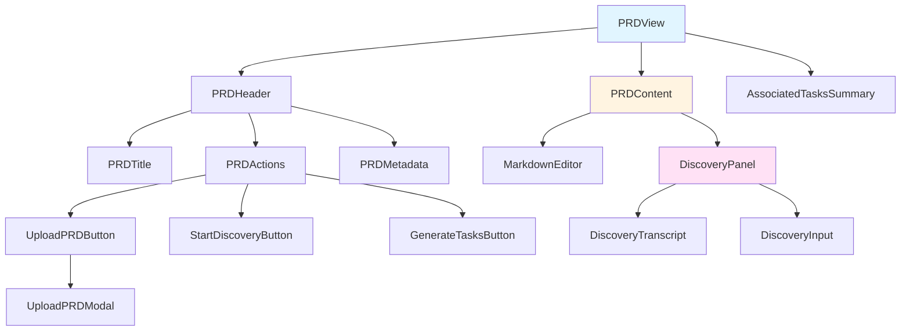
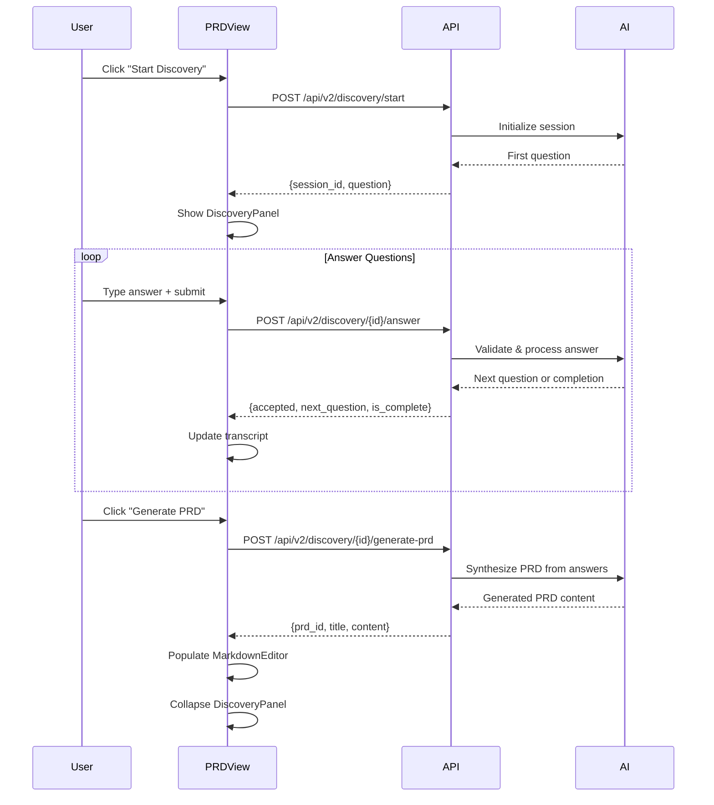

# Implementation Plan: PRD View - Document Creation & Discovery

**Issue:** #330 — [Phase 3] PRD View - Document Creation & Discovery
**Last updated:** 2026-02-05

---

## Observations

The codebase is ready for PRD View implementation:

- **Backend APIs**: Complete v2 endpoints for PRD (`codeframe/ui/routers/prd_v2.py`), discovery (`codeframe/ui/routers/discovery_v2.py`), and tasks (`codeframe/ui/routers/tasks_v2.py`)
- **Frontend Stack**: Next.js 14 App Router, Shadcn/UI (Nova template, gray color scheme), Tailwind CSS, Hugeicons (`@hugeicons/react`), Nunito Sans font
- **Active UI Directory**: `web-ui/` — all new files go here (not `legacy/web-ui/`)
- **Existing Patterns**: `web-ui/src/lib/api.ts` uses axios with namespace objects (`workspaceApi`, `tasksApi`). Types live in `web-ui/src/types/index.ts`. Components are organized in subdirectories under `web-ui/src/components/`.
- **Legacy Reference**: `legacy/web-ui/src/components/PRDModal.tsx` and `legacy/web-ui/src/components/DiscoveryProgress.tsx` exist as reference only — do not import or extend them.
- **Streaming Infrastructure**: SSE support via `codeframe/core/streaming.py` with EventPublisher for real-time updates

---

## Approach

Following the Phase 3 UI Architecture (`docs/PHASE_3_UI_ARCHITECTURE.md` Section 3.2), implement the PRD View as a standalone route with integrated discovery session support. The approach prioritizes:

1. **Component-first development**: Build reusable UI components matching the architecture's component hierarchy
2. **API integration**: Connect to existing v2 endpoints without backend changes
3. **Real-time streaming**: Implement SSE for discovery chat responses
4. **Progressive enhancement**: Start with core functionality (upload/edit PRD), then add discovery, then task generation

---

## Acceptance Criteria (from issue #330)

- [ ] Upload PRD via file picker or paste markdown
- [ ] Markdown editor with live preview
- [ ] Start discovery session button launches chat panel
- [ ] Chat-style discovery with AI avatar/branding
- [ ] Thinking indicator while AI generates responses
- [ ] Discovery panel slides in from right
- [ ] "Skip discovery" option to write PRD manually
- [ ] Generate tasks button (enabled when PRD exists)
- [ ] Shows associated task counts by status
- [ ] Responsive two-column layout during discovery

---

## API Endpoints (verified against backend routers)

### PRD (`/api/v2/prd`)
| Method | Path | Purpose |
|--------|------|---------|
| `GET` | `/api/v2/prd` | List all PRDs |
| `GET` | `/api/v2/prd/latest` | Get latest PRD |
| `GET` | `/api/v2/prd/{prd_id}` | Get specific PRD |
| `POST` | `/api/v2/prd` | Create PRD |
| `DELETE` | `/api/v2/prd/{prd_id}` | Delete PRD |
| `GET` | `/api/v2/prd/{prd_id}/versions` | List PRD versions |
| `POST` | `/api/v2/prd/{prd_id}/versions` | Create new version |
| `GET` | `/api/v2/prd/{prd_id}/diff` | Diff two versions |

### Discovery (`/api/v2/discovery`)
| Method | Path | Purpose |
|--------|------|---------|
| `POST` | `/api/v2/discovery/start` | Start discovery session |
| `GET` | `/api/v2/discovery/status` | Get session status |
| `POST` | `/api/v2/discovery/{session_id}/answer` | Submit answer |
| `POST` | `/api/v2/discovery/{session_id}/generate-prd` | Generate PRD from session |
| `POST` | `/api/v2/discovery/reset` | Reset discovery |
| `POST` | `/api/v2/discovery/generate-tasks` | Generate tasks from PRD |

### Tasks (`/api/v2/tasks`)
| Method | Path | Purpose |
|--------|------|---------|
| `GET` | `/api/v2/tasks` | List tasks (with status filter) |

---

## Implementation Steps

### 1. Define TypeScript Types

**Create PRD-specific types:**
- Create `web-ui/src/types/prd.ts` with interfaces:
  - `PrdRecord` — id, workspace_id, title, content, metadata, created_at, version, parent_id, change_summary, chain_id
  - `PrdSummaryResponse` — id, title, version, created_at
  - `PrdListResponse` — items array + total
  - `DiscoverySession` — session_id, state, question, answered_count, is_complete
  - `DiscoveryMessage` — role: `'user' | 'assistant'`, content, timestamp
  - `TaskGenerationResult` — task_count, tasks
- Re-export from `web-ui/src/types/index.ts`

### 2. Extend API Client

**Add PRD and Discovery methods to `web-ui/src/lib/api.ts`:**

```ts
export const prdApi = {
  getLatest: (workspacePath: string) => ...,
  getAll: (workspacePath: string) => ...,
  create: (workspacePath: string, content: string, title?: string) => ...,
  createVersion: (prdId: string, content: string, changeSummary?: string) => ...,
  getVersions: (prdId: string) => ...,
};

export const discoveryApi = {
  start: (workspacePath: string) => ...,
  getStatus: (workspacePath: string) => ...,
  submitAnswer: (sessionId: string, answer: string, workspacePath: string) => ...,
  generatePrd: (sessionId: string, workspacePath: string) => ...,
  reset: (workspacePath: string) => ...,
  generateTasks: (workspacePath: string) => ...,
};
```

All methods follow the existing axios pattern with `workspace_path` query params.

### 3. Create Route Structure

- Create `web-ui/src/app/prd/page.tsx` — main PRD editor view
- Create `web-ui/src/app/prd/discovery/page.tsx` — discovery session (can also be handled as state within main view)

### 4. Build Core Components

All components go under `web-ui/src/components/prd/`.

#### PRDView (Main Container)
- File: `web-ui/src/components/prd/PRDView.tsx`
- State management: PRD content, discovery session, task summary
- Layout: Responsive grid — single column default, two-column when discovery active
- Integrates all child components

#### PRDHeader
- File: `web-ui/src/components/prd/PRDHeader.tsx`
- Sub-components:
  - **PRDTitle**: Inline editable title (contentEditable or input field)
  - **PRDActions**: Button group — Upload, Start Discovery, Generate Tasks
  - **PRDMetadata**: Version, file path, timestamps
- Uses Shadcn Button, Input components
- Icons from `@hugeicons/react` (e.g., `FileEditIcon`, `MessageSearch01Icon`, `TaskEdit01Icon`)

#### PRDContent
- File: `web-ui/src/components/prd/PRDContent.tsx`
- Two-column layout using CSS Grid
- Left pane: MarkdownEditor (full-width when discovery inactive)
- Right pane: DiscoveryPanel (collapsible, slides in from right)

#### MarkdownEditor
- File: `web-ui/src/components/prd/MarkdownEditor.tsx`
- Split view: textarea for editing + rendered preview via `react-markdown`
- Debounced auto-save to prevent excessive API calls
- Install `react-markdown` if not already in `web-ui/package.json`

#### DiscoveryPanel
- File: `web-ui/src/components/prd/DiscoveryPanel.tsx`
- Collapsible panel with slide-in animation (`transform transition-transform duration-300`)
- Contains DiscoveryTranscript and DiscoveryInput
- Close/"Skip discovery" button at top

#### DiscoveryTranscript
- File: `web-ui/src/components/prd/DiscoveryTranscript.tsx`
- Chat-style message list
- Message bubbles: User (right-aligned) vs AI (left-aligned, muted background)
- AI avatar/branding using Hugeicons (`ArtificialIntelligence06Icon` or similar)
- Auto-scroll to bottom on new messages
- Thinking indicator: animated dots while AI generates response

#### DiscoveryInput
- File: `web-ui/src/components/prd/DiscoveryInput.tsx`
- Textarea with send button
- Keyboard shortcut: Ctrl+Enter to submit
- Disabled state while waiting for AI response

#### AssociatedTasksSummary
- File: `web-ui/src/components/prd/AssociatedTasksSummary.tsx`
- Compact badge display showing task counts by status
- Uses Shadcn Badge component
- Format: `READY: 5 | IN_PROGRESS: 2 | DONE: 8`

#### UploadPRDModal
- File: `web-ui/src/components/prd/UploadPRDModal.tsx`
- Shadcn Dialog component
- Two modes: File Upload (`.md` files via FileReader API) | Paste Markdown
- Validation: check content length
- On submit: calls `prdApi.create()`, updates PRDView state

### 5. Implement Upload/Paste PRD Flow

**Acceptance criteria addressed:**
- [x] Upload PRD via file picker or paste markdown

**Flow:**
1. User clicks "Upload PRD" in PRDHeader
2. UploadPRDModal opens with file picker or paste textarea
3. On submit → `POST /api/v2/prd` with content
4. PRDView state updated with returned PrdRecord
5. MarkdownEditor populated with content

### 6. Implement Discovery Session Flow

**Acceptance criteria addressed:**
- [x] Start discovery session button launches chat panel
- [x] Chat-style discovery with AI avatar/branding
- [x] Thinking indicator while AI generates responses
- [x] Discovery panel slides in from right
- [x] "Skip discovery" option to write PRD manually

**State management in PRDView:**
- Track discovery state: `idle | discovering | completed`
- Store session_id, messages array, current question

**Start Discovery:**
1. Button click → `POST /api/v2/discovery/start`
2. Response: `{ session_id, question }`
3. DiscoveryPanel slides in from right
4. First question displayed in DiscoveryTranscript

**Answer Submission:**
1. User types answer → Ctrl+Enter or click send
2. Show thinking indicator (animated dots)
3. `POST /api/v2/discovery/{session_id}/answer` with answer text
4. Response: `{ accepted, next_question, is_complete }`
5. Append user message and AI response to transcript
6. If `is_complete`: show "Generate PRD" button

**Generate PRD from Discovery:**
1. Click "Generate PRD" → `POST /api/v2/discovery/{session_id}/generate-prd`
2. Show loading spinner
3. Response: `{ prd_id, title, preview }`
4. Fetch full PRD via `GET /api/v2/prd/latest`
5. Populate MarkdownEditor
6. Collapse DiscoveryPanel, show success toast

**Skip Discovery:**
- "Skip Discovery" / close button in DiscoveryPanel header
- Closes panel, user writes PRD manually in MarkdownEditor

### 7. Implement Task Generation

**Acceptance criteria addressed:**
- [x] Generate tasks button (enabled when PRD exists)
- [x] Shows associated task counts by status

**Flow:**
1. "Generate Tasks" button in PRDHeader, enabled when PRD content exists
2. Click → `POST /api/v2/discovery/generate-tasks`
3. Show loading state
4. Response: `{ task_count, tasks }`
5. Update AssociatedTasksSummary with counts
6. Show success toast: "Generated X tasks"

### 8. SSE Integration for Discovery (Enhancement)

**Create custom hook:**
- File: `web-ui/src/hooks/useDiscoveryStream.ts`
- Connects to SSE endpoint when discovery session is active
- Events: `discovery_question_ready`, `discovery_completed`, `prd_generation_started`, `prd_generation_completed`
- Graceful fallback to polling if SSE unavailable

### 9. Navigation Update

- Update `web-ui/src/app/layout.tsx` or create sidebar component
- Add PRD link to primary navigation (document icon: `FileEditIcon` from Hugeicons)
- Per architecture Section 2: sidebar with icon + label

### 10. Styling and Responsiveness

**Acceptance criteria addressed:**
- [x] Responsive two-column layout during discovery
- [x] Markdown editor with live preview

**Layout:**
- Two-column: `grid grid-cols-1 lg:grid-cols-2 gap-4`
- Discovery slide-in: `transform transition-transform duration-300`
- Markdown preview: `prose prose-sm max-w-none` (Tailwind Typography plugin)
- Use Shadcn/UI theme variables: `bg-card`, `text-foreground`, `border-border`

**Mobile:**
- Stack columns vertically on mobile
- Discovery panel becomes full-width overlay on small screens

### 11. Error Handling and Loading States

- Skeleton loaders for PRD content while fetching
- Spinner for discovery answer submission
- Disabled states for buttons during operations
- Error toast for API failures (consistent with existing `normalizeErrorDetail` in api.ts)
- Client-side validation for answer length

### 12. Testing

**Component Tests (Jest):**
- PRDView rendering with different states (idle, discovering, completed)
- MarkdownEditor editing and preview
- DiscoveryPanel message display and submission
- Mock API calls

**Integration Tests:**
- Full discovery flow: start → answer questions → generate PRD
- Upload PRD flow
- Task generation from PRD

---

## File Structure (all under `web-ui/`)

```
web-ui/src/
├── app/
│   └── prd/
│       ├── page.tsx                    # Main PRD route
│       └── discovery/
│           └── page.tsx                # Discovery sub-route (optional)
├── components/
│   ├── prd/
│   │   ├── PRDView.tsx                 # Main container
│   │   ├── PRDHeader.tsx               # Header with actions
│   │   ├── PRDContent.tsx              # Two-column layout
│   │   ├── MarkdownEditor.tsx          # Editor + preview
│   │   ├── DiscoveryPanel.tsx          # Collapsible chat panel
│   │   ├── DiscoveryTranscript.tsx     # Message list
│   │   ├── DiscoveryInput.tsx          # Answer input
│   │   ├── AssociatedTasksSummary.tsx  # Task count badges
│   │   ├── UploadPRDModal.tsx          # Upload/paste modal
│   │   └── index.ts                    # Barrel export
│   └── ui/                             # Existing Shadcn components
├── hooks/
│   └── useDiscoveryStream.ts           # SSE hook for discovery
├── lib/
│   └── api.ts                          # Add prdApi + discoveryApi
└── types/
    ├── index.ts                        # Re-export prd types
    └── prd.ts                          # PRD-specific types
```

---

## Component Dependency Graph



## Discovery Session Flow



---

## Implementation Order

Recommended build sequence (each step produces a testable increment):

1. **Types + API client** — foundation, no UI yet
2. **PRD route + PRDView shell** — renders empty page at `/prd`
3. **PRDHeader + UploadPRDModal** — can upload/paste a PRD
4. **MarkdownEditor** — can view and edit PRD content
5. **DiscoveryPanel + Transcript + Input** — discovery conversation works
6. **AssociatedTasksSummary + task generation** — end-to-end golden path
7. **SSE hook** — real-time streaming enhancement
8. **Navigation update** — sidebar link to `/prd`
9. **Testing** — component + integration tests
