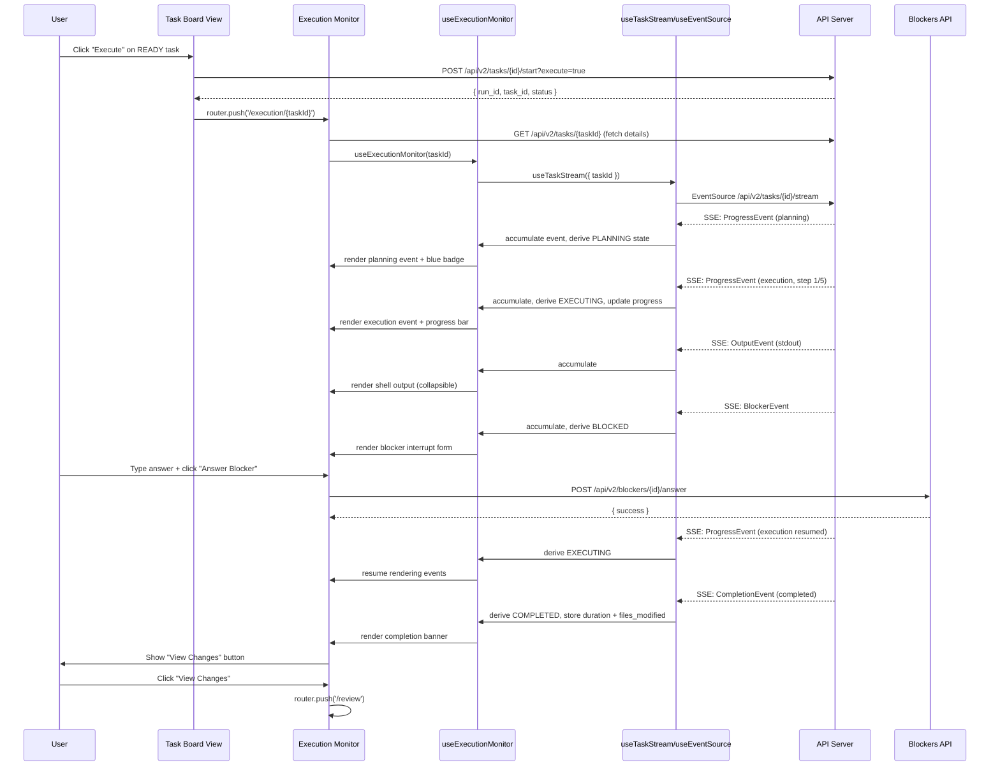

# Implementation Plan: Execution Monitor View - Real-time Agent Monitoring

**Issue:** #332 — [Phase 3] Execution Monitor View - Real-time Agent Monitoring
**Last updated:** 2026-02-06

---

## Observations

The codebase has strong foundations for this implementation:

- **Backend SSE streaming**: Complete in `codeframe/ui/routers/streaming_v2.py` — endpoint `GET /api/v2/tasks/{task_id}/stream` with typed events (progress, output, blocker, completion, error, heartbeat)
- **Existing SSE hooks**: `web-ui/src/hooks/useEventSource.ts` (generic SSE with exponential backoff reconnection) and `web-ui/src/hooks/useTaskStream.ts` (typed execution event parsing) — both built during #331
- **Existing execution event types**: Already defined in `web-ui/src/hooks/useTaskStream.ts` — `ProgressEvent`, `OutputEvent`, `BlockerEvent`, `CompletionEvent`, `ErrorEvent`, `HeartbeatEvent`
- **Task Board execute handlers**: `tasksApi.startExecution()` and `tasksApi.executeBatch()` exist in `web-ui/src/lib/api.ts`
- **Backend execution control**: `POST /api/v2/tasks/{id}/stop` and `POST /api/v2/tasks/{id}/resume` exist; NO `pause` endpoint exists
- **Backend blocker API**: `POST /api/v2/blockers/{id}/answer` and `POST /api/v2/blockers/{id}/resolve` exist in `codeframe/ui/routers/blockers_v2.py`
- **Batch API**: `GET /api/v2/batches/{batch_id}` returns `BatchResponse` with `task_ids`, `results` (task_id → status), and batch-level controls
- **Frontend Stack**: Next.js App Router, Shadcn/UI (Nova template, gray scheme), Tailwind CSS, Hugeicons (`@hugeicons/react`), Nunito Sans font
- **Active UI Directory**: `web-ui/` — all new files go here (NOT `legacy/web-ui/`)

### Critical Gap from #331

The Task Board View (#331) implemented execute buttons and API calls, but **does not navigate to the Execution Monitor after starting execution**. The current `handleExecute` in `TaskBoardView.tsx` calls the API and refreshes the board, but never routes to `/execution`. This plan addresses that gap in Step 1.

---

## Approach

1. **Bridge the gap**: Update the Task Board's execute handlers to navigate to the Execution Monitor with the relevant task/batch ID
2. **Leverage existing hooks**: Compose `useTaskStream` (not recreate it) into a higher-level `useExecutionMonitor` hook that accumulates events and derives UI state
3. **Two monitoring modes**: Single-task monitoring at `/execution/[taskId]` and batch monitoring at `/execution?batch=<batchId>`
4. **Completion flow**: On task completion, show success/failure summary with "View Changes" navigation to the Review view
5. **No pause endpoint**: The backend has `stop` and `resume` but no `pause`. UI shows Stop (with confirmation) instead of Pause

---

## Acceptance Criteria (from issue #332)

| # | Criterion | Covered in Step |
|---|-----------|-----------------|
| 1 | SSE connection to `/api/v2/tasks/{id}/stream` | Step 3 (leverages existing `useTaskStream`) |
| 2 | Real-time event stream with timestamps | Step 5 |
| 3 | Color-coded event type badges | Step 4 |
| 4 | Collapsible file diff previews | Step 5 (FileChangeEvent) |
| 5 | Collapsible shell command output (monospace) | Step 5 (ShellCommandEvent) |
| 6 | Progress bar with step counter | Step 6 (ProgressIndicator) |
| 7 | Auto-scroll to bottom (with toggle) | Step 6 (EventStream) |
| 8 | "New events" button when scrolled up | Step 6 (EventStream) |
| 9 | Pause/stop controls with confirmation | Step 6 (ExecutionHeader) — Stop only, no backend pause endpoint |
| 10 | Inline blocker answer form (interrupt pattern) | Step 5 (BlockerEvent) |
| 11 | Changes sidebar with file tree | Step 6 (ChangesSidebar) |
| 12 | Auto-navigate here when execution starts | Step 1 (Task Board navigation bridge) |
| 13 | Reconnection with exponential backoff | Already implemented in `useEventSource.ts` |

---

## API Endpoints (verified against backend routers)

### Streaming (`/api/v2/tasks`)
| Method | Path | Purpose |
|--------|------|---------|
| `GET` | `/api/v2/tasks/{task_id}/stream` | SSE event stream |
| `POST` | `/api/v2/tasks/{task_id}/stop` | Stop execution |
| `POST` | `/api/v2/tasks/{task_id}/resume` | Resume blocked task |
| `GET` | `/api/v2/tasks/{task_id}` | Get task details (for title, description) |
| `GET` | `/api/v2/tasks/{task_id}/run` | Get latest run for task |

### Blockers (`/api/v2/blockers`)
| Method | Path | Purpose |
|--------|------|---------|
| `POST` | `/api/v2/blockers/{id}/answer` | Answer a blocker |
| `POST` | `/api/v2/blockers/{id}/resolve` | Mark blocker resolved |
| `GET` | `/api/v2/blockers?task_id={id}` | Get blockers for task |

### Batches (`/api/v2/batches`)
| Method | Path | Purpose |
|--------|------|---------|
| `GET` | `/api/v2/batches/{batch_id}` | Get batch details (task_ids, results) |
| `POST` | `/api/v2/batches/{batch_id}/stop` | Stop batch |
| `POST` | `/api/v2/batches/{batch_id}/cancel` | Cancel batch |

All endpoints require `workspace_path` query parameter.

---

## Implementation Steps

### Step 1. Bridge Gap: Task Board → Execution Monitor Navigation

**File:** `web-ui/src/components/tasks/TaskBoardView.tsx`

Update `handleExecute` and `handleExecuteBatch` to navigate after successful API calls:

```typescript
import { useRouter } from 'next/navigation';
// ...
const router = useRouter();

const handleExecute = useCallback(async (taskId: string) => {
  setActionError(null);
  try {
    const result = await tasksApi.startExecution(workspacePath, taskId);
    setDetailTaskId(null);
    // Navigate to execution monitor with the task ID
    router.push(`/execution/${taskId}`);
  } catch (err) {
    const apiErr = err as ApiError;
    setActionError(apiErr.detail || 'Failed to start execution');
  }
}, [workspacePath, router]);

const handleExecuteBatch = useCallback(async () => {
  if (selectedTaskIds.size === 0) return;
  setIsExecuting(true);
  setActionError(null);
  try {
    const result = await tasksApi.executeBatch(workspacePath, {
      task_ids: Array.from(selectedTaskIds),
      strategy: batchStrategy,
    });
    setSelectionMode(false);
    setSelectedTaskIds(new Set());
    // Navigate to execution monitor with batch context
    router.push(`/execution?batch=${result.batch_id}`);
  } catch (err) {
    const apiErr = err as ApiError;
    setActionError(apiErr.detail || 'Failed to start batch execution');
  } finally {
    setIsExecuting(false);
  }
}, [workspacePath, selectedTaskIds, batchStrategy, router]);
```

**Acceptance criteria addressed:** #12

### Step 2. Add Execution & Blocker Types

**File:** `web-ui/src/types/index.ts`

Add new types (the execution event types already live in `hooks/useTaskStream.ts` — no duplication needed):

```typescript
// Blocker types (mirrors blockers_v2.py)
export type BlockerStatus = 'OPEN' | 'ANSWERED' | 'RESOLVED';

export interface Blocker {
  id: string;
  workspace_id: string;
  task_id: string | null;
  question: string;
  answer: string | null;
  status: BlockerStatus;
  created_at: string;
  answered_at: string | null;
}

export interface BlockerListResponse {
  blockers: Blocker[];
  total: number;
  by_status: Record<string, number>;
}

// Batch types (mirrors batches_v2.py)
export interface BatchResponse {
  id: string;
  workspace_id: string;
  task_ids: string[];
  status: string;
  strategy: string;
  max_parallel: number;
  on_failure: string;
  started_at: string | null;
  completed_at: string | null;
  results: Record<string, string>; // task_id → RunStatus
}

// UI-derived agent state for display
export type UIAgentState =
  | 'CONNECTING'
  | 'PLANNING'
  | 'EXECUTING'
  | 'VERIFICATION'
  | 'SELF_CORRECTING'
  | 'BLOCKED'
  | 'COMPLETED'
  | 'FAILED'
  | 'DISCONNECTED';
```

### Step 3. Extend API Client

**File:** `web-ui/src/lib/api.ts`

Add `blockersApi`, `batchesApi`, and execution control methods to `tasksApi`:

```typescript
// Add to tasksApi:
  stopExecution: async (workspacePath: string, taskId: string): Promise<void> => {
    await api.post(`/api/v2/tasks/${taskId}/stop`, {}, {
      params: { workspace_path: workspacePath },
    });
  },

  resumeExecution: async (workspacePath: string, taskId: string): Promise<void> => {
    await api.post(`/api/v2/tasks/${taskId}/resume`, {}, {
      params: { workspace_path: workspacePath },
    });
  },

// New blockersApi namespace:
export const blockersApi = {
  getForTask: async (workspacePath: string, taskId: string): Promise<BlockerListResponse> => {
    const response = await api.get<BlockerListResponse>('/api/v2/blockers', {
      params: { workspace_path: workspacePath, task_id: taskId },
    });
    return response.data;
  },

  answer: async (
    workspacePath: string,
    blockerId: string,
    answer: string
  ): Promise<Blocker> => {
    const response = await api.post<Blocker>(
      `/api/v2/blockers/${blockerId}/answer`,
      { answer },
      { params: { workspace_path: workspacePath } }
    );
    return response.data;
  },

  resolve: async (workspacePath: string, blockerId: string): Promise<Blocker> => {
    const response = await api.post<Blocker>(
      `/api/v2/blockers/${blockerId}/resolve`,
      {},
      { params: { workspace_path: workspacePath } }
    );
    return response.data;
  },
};

// New batchesApi namespace:
export const batchesApi = {
  get: async (workspacePath: string, batchId: string): Promise<BatchResponse> => {
    const response = await api.get<BatchResponse>(`/api/v2/batches/${batchId}`, {
      params: { workspace_path: workspacePath },
    });
    return response.data;
  },

  stop: async (workspacePath: string, batchId: string): Promise<BatchResponse> => {
    const response = await api.post<BatchResponse>(
      `/api/v2/batches/${batchId}/stop`,
      {},
      { params: { workspace_path: workspacePath } }
    );
    return response.data;
  },

  cancel: async (workspacePath: string, batchId: string): Promise<BatchResponse> => {
    const response = await api.post<BatchResponse>(
      `/api/v2/batches/${batchId}/cancel`,
      {},
      { params: { workspace_path: workspacePath } }
    );
    return response.data;
  },
};
```

Add appropriate type imports at the top of the file.

### Step 4. Create Event Styling Utilities

**File:** `web-ui/src/lib/eventStyles.ts`

Centralized styling constants for event types — used by all event components:

```typescript
import type { UIAgentState } from '@/types';
import type { ExecutionEventType, ProgressEvent } from '@/hooks/useTaskStream';

// Map backend phase strings to UI agent states
export function deriveAgentState(event: { event_type: ExecutionEventType; phase?: string; status?: string }): UIAgentState {
  switch (event.event_type) {
    case 'progress': {
      const phase = (event as ProgressEvent).phase;
      switch (phase) {
        case 'planning': return 'PLANNING';
        case 'execution': return 'EXECUTING';
        case 'verification': return 'VERIFICATION';
        case 'self_correction': return 'SELF_CORRECTING';
        default: return 'EXECUTING';
      }
    }
    case 'blocker': return 'BLOCKED';
    case 'completion': return event.status === 'completed' ? 'COMPLETED' : 'FAILED';
    case 'error': return 'FAILED';
    default: return 'EXECUTING';
  }
}

// Badge colors by UI state
export const agentStateBadgeStyles: Record<UIAgentState, string> = {
  CONNECTING: 'bg-gray-100 text-gray-800',
  PLANNING: 'bg-blue-100 text-blue-800',
  EXECUTING: 'bg-green-100 text-green-800',
  VERIFICATION: 'bg-orange-100 text-orange-800',
  SELF_CORRECTING: 'bg-yellow-100 text-yellow-800',
  BLOCKED: 'bg-red-100 text-red-800',
  COMPLETED: 'bg-green-100 text-green-800',
  FAILED: 'bg-red-100 text-red-800',
  DISCONNECTED: 'bg-gray-100 text-gray-800',
};
```

Include icon mappings using Hugeicons (`@hugeicons/react`).

### Step 5. Create Event Display Components

All components under `web-ui/src/components/execution/`.

#### EventItem (base event renderer)

**File:** `web-ui/src/components/execution/EventItem.tsx`

- Accepts `event: ExecutionEvent` prop
- Renders timestamp in `HH:mm:ss` format
- Renders event type badge using styles from `eventStyles.ts`
- Delegates to specialized component based on `event.event_type` and `phase`

#### PlanningEvent

**File:** `web-ui/src/components/execution/PlanningEvent.tsx`

- Indented bullet list of plan steps from `ProgressEvent` messages
- Monospace font for step descriptions
- Step count summary

#### FileChangeEvent

**File:** `web-ui/src/components/execution/FileChangeEvent.tsx`

- File path with Hugeicon (`FileEditIcon`)
- Collapsible diff preview using Shadcn `Collapsible`
- Simple color coding: green for additions, red for deletions
- Truncate large diffs with "Show more" button

#### ShellCommandEvent

**File:** `web-ui/src/components/execution/ShellCommandEvent.tsx`

- Command in monospace font with terminal icon (`CommandLineIcon`)
- Collapsible stdout/stderr output section
- Exit code indicator (green checkmark / red X)

**Acceptance criteria addressed:** #5

#### VerificationEvent

**File:** `web-ui/src/components/execution/VerificationEvent.tsx`

- Gate type display (ruff, pytest) with icon
- Pass/fail badge with animation: orange (running) → green (passed) or red (failed)
- Collapsible detailed results

#### BlockerEvent

**File:** `web-ui/src/components/execution/BlockerEvent.tsx`

- Highlighted card with red border (interrupt pattern matching architecture doc Section 4)
- "Agent needs your help" header with `Alert02Icon`
- Blocker question in prominent text
- Inline textarea for answer input
- "Answer Blocker" button → calls `blockersApi.answer()`
- "Execution paused - waiting for response..." status message
- On successful answer: show confirmation, event stream resumes automatically

**Acceptance criteria addressed:** #10

**Props:**
```typescript
interface BlockerEventProps {
  event: BlockerEvent;
  workspacePath: string;
  onAnswered: () => void; // callback to refresh state after answering
}
```

### Step 6. Create Container Components

#### ExecutionHeader

**File:** `web-ui/src/components/execution/ExecutionHeader.tsx`

- Task title (fetched from `tasksApi.getOne()`)
- `AgentStateBadge` showing current derived state
- `ConnectionStatus` indicator (green/yellow/red dot based on SSE status)
- Stop button with `AlertDialog` confirmation (no pause — backend doesn't support it)
- Disabled controls when task is completed/failed

**Props:**
```typescript
interface ExecutionHeaderProps {
  task: Task | null;
  agentState: UIAgentState;
  sseStatus: SSEStatus;
  onStop: () => void;
  isCompleted: boolean;
}
```

**Acceptance criteria addressed:** #9

#### EventStream

**File:** `web-ui/src/components/execution/EventStream.tsx`

- Accepts `events: ExecutionEvent[]` prop
- Renders `EventItem` for each event (filtered: no heartbeats displayed)
- **Auto-scroll**: `useEffect` with `scrollIntoView` on new events
- **Scroll detection**: `IntersectionObserver` on a sentinel element at bottom
- When user scrolls up: pause auto-scroll, show "New events ↓" button (floating, bottom-center)
- Click "New events ↓" or manual scroll to bottom: re-enable auto-scroll
- Toggle button in bottom-right corner for auto-scroll preference
- Uses Shadcn `ScrollArea` for smooth scrolling

**Acceptance criteria addressed:** #2, #3, #7, #8

#### ProgressIndicator

**File:** `web-ui/src/components/execution/ProgressIndicator.tsx`

- Parses step/total_steps from latest `ProgressEvent`
- Displays "Step X of Y: [message]" format
- Shadcn `Progress` bar with percentage
- Shows phase label (Planning, Executing, Verifying, etc.)

**Acceptance criteria addressed:** #6

#### ChangesSidebar

**File:** `web-ui/src/components/execution/ChangesSidebar.tsx`

- Collapsible right panel using Shadcn `Sheet`
- Accumulates changed files from `OutputEvent` and `ProgressEvent` events where the message references file paths
- Renders file tree with nested folder structure
- Click file to show diff preview in sidebar
- Collapse/expand toggle button

**Acceptance criteria addressed:** #11

### Step 7. Create useExecutionMonitor Hook

**File:** `web-ui/src/hooks/useExecutionMonitor.ts`

Composes `useTaskStream` into a higher-level hook that manages accumulated state for the Execution Monitor View:

```typescript
export interface ExecutionMonitorState {
  events: ExecutionEvent[];
  agentState: UIAgentState;
  currentStep: number;
  totalSteps: number;
  currentPhase: string;
  currentMessage: string;
  changedFiles: string[];
  isCompleted: boolean;
  completionStatus: 'completed' | 'failed' | 'blocked' | null;
  duration: number | null;
  sseStatus: SSEStatus;
}

export function useExecutionMonitor(taskId: string | null): ExecutionMonitorState & { close: () => void }
```

Implementation:
- Uses `useTaskStream` underneath for SSE connection
- Accumulates events in a `useRef` array (avoids re-renders on every event; batches updates with `requestAnimationFrame`)
- Derives `agentState` from latest non-heartbeat event using `deriveAgentState()`
- Tracks progress from `ProgressEvent` step/total_steps
- Collects changed files from completion events (`files_modified` field)
- Detects completion and stores final status/duration
- Exposes `close()` to manually disconnect

### Step 8. Create Single Task Execution Page

**File:** `web-ui/src/app/execution/[taskId]/page.tsx`

Main single-task execution monitoring page:

```typescript
'use client';

import { useState, useEffect } from 'react';
import { useParams, useRouter } from 'next/navigation';
import { useExecutionMonitor } from '@/hooks/useExecutionMonitor';
import { tasksApi } from '@/lib/api';
import { getSelectedWorkspacePath } from '@/lib/workspace-storage';
// ... component imports
```

- Reads `taskId` from route params
- Gets `workspacePath` from localStorage (same pattern as tasks/prd pages)
- Fetches task details via `tasksApi.getOne()`
- Uses `useExecutionMonitor(taskId)` for real-time state
- Composes layout:
  ```
  ExecutionHeader
  ProgressIndicator
  <main content area with EventStream + ChangesSidebar>
  ```
- On completion: shows summary banner with:
  - Success: green banner + "View Changes" button → `router.push('/review')`
  - Failed: red banner + error summary + "View Diagnostics" option
  - Blocked: amber banner + "Blocker was raised" message (handled inline in stream)
- Loading state while connecting to SSE
- Error state when task not found

**Acceptance criteria addressed:** #1, #4

### Step 9. Create Execution Landing Page

**File:** `web-ui/src/app/execution/page.tsx`

Landing page that handles routing logic:

- Reads `?batch=<batchId>` query param → renders `BatchExecutionMonitor`
- Reads `?task=<taskId>` query param → redirects to `/execution/[taskId]`
- No query params → fetches latest IN_PROGRESS task via `tasksApi.getAll(workspacePath, 'IN_PROGRESS')`:
  - If found: redirects to `/execution/[taskId]`
  - If none: shows "No active execution" empty state with link back to Task Board

### Step 10. Create BatchExecutionMonitor

**File:** `web-ui/src/components/execution/BatchExecutionMonitor.tsx`

Multi-task batch monitoring view (matches architecture doc Section 5.4):

```
┌─────────────────────────────────────────────────────┐
│ Batch Execution (5 tasks)                           │
│ Strategy: Parallel (max 3)                          │
│                                                     │
│ ✓ Task 1: Add authentication [COMPLETED] 45s       │
│ ⟳ Task 2: Write tests [IN_PROGRESS] 12s            │
│   └─ [View Live Output ▼]                          │
│ ⏸ Task 3: Update docs [WAITING] (depends on 2)     │
│ ✗ Task 4: Deploy API [FAILED] 8s                   │
│   └─ [View Error ▼]                                │
│ ● Task 5: Lint code [READY]                        │
│                                                     │
│ [Stop Batch] [Cancel Batch]                         │
└─────────────────────────────────────────────────────┘
```

- Fetches batch details via `batchesApi.get()` (gets task_ids and results map)
- Renders a task row per task with status badge and duration
- Expandable rows: click to see live event stream for that task (uses `useExecutionMonitor` per expanded task)
- Only one task expanded at a time (accordion pattern) — auto-expand the currently IN_PROGRESS task
- Batch-level controls: "Stop Batch" and "Cancel Batch" buttons with confirmation
- Polls batch status every 5 seconds (or on event completion) to update results map
- When all tasks complete: show batch summary with "View Changes" button

**Props:**
```typescript
interface BatchExecutionMonitorProps {
  batchId: string;
  workspacePath: string;
}
```

### Step 11. Enable Navigation Link

**File:** `web-ui/src/components/layout/AppSidebar.tsx`

- Add "Execution" nav item with Hugeicons `PlayIcon` or `Activity01Icon`
- Position between "Tasks" and existing items
- Conditionally visible: show when there are IN_PROGRESS tasks (can check via SWR or simple state)
- Link to `/execution`

### Step 12. Barrel Export

**File:** `web-ui/src/components/execution/index.ts`

```typescript
export { EventItem } from './EventItem';
export { PlanningEvent } from './PlanningEvent';
export { FileChangeEvent } from './FileChangeEvent';
export { ShellCommandEvent } from './ShellCommandEvent';
export { VerificationEvent } from './VerificationEvent';
export { BlockerEvent } from './BlockerEvent';
export { ExecutionHeader } from './ExecutionHeader';
export { EventStream } from './EventStream';
export { ProgressIndicator } from './ProgressIndicator';
export { ChangesSidebar } from './ChangesSidebar';
export { BatchExecutionMonitor } from './BatchExecutionMonitor';
```

### Step 13. Testing

**Component tests (Jest):**
- `__tests__/components/execution/EventItem.test.tsx` — renders each event type with correct badge and content
- `__tests__/components/execution/BlockerEvent.test.tsx` — renders form, submits answer, calls API
- `__tests__/components/execution/EventStream.test.tsx` — renders event list, auto-scroll behavior
- `__tests__/hooks/useExecutionMonitor.test.ts` — accumulates events, derives state correctly

**Manual testing checklist:**
- [ ] Start single task from Task Board → auto-navigate to `/execution/[taskId]`
- [ ] SSE connects and events stream in real-time
- [ ] Progress bar updates with each step
- [ ] Shell command output is collapsible and monospace
- [ ] File diff previews expand/collapse
- [ ] Blocker appears as interrupt with inline answer form
- [ ] Answer blocker → execution resumes
- [ ] Stop button shows confirmation dialog, stops task on confirm
- [ ] Completion shows summary banner with "View Changes" link
- [ ] Connection lost → reconnection indicator → auto-reconnect
- [ ] Batch execute from Task Board → batch monitor view
- [ ] Batch monitor shows per-task status rows
- [ ] Expand running task to see live event stream
- [ ] Navigate away and back → execution page finds active task

---

## File Structure (all under `web-ui/`)

```
web-ui/src/
├── app/
│   └── execution/
│       ├── page.tsx                          # Landing page (batch view or redirect)
│       └── [taskId]/
│           └── page.tsx                      # Single task execution monitor
├── components/
│   └── execution/
│       ├── index.ts                          # Barrel export
│       ├── EventItem.tsx                     # Base event renderer with timestamp + badge
│       ├── PlanningEvent.tsx                 # Plan steps display
│       ├── FileChangeEvent.tsx               # Collapsible file diff
│       ├── ShellCommandEvent.tsx             # Collapsible command output
│       ├── VerificationEvent.tsx             # Gate results (ruff/pytest)
│       ├── BlockerEvent.tsx                  # Inline blocker answer form
│       ├── ExecutionHeader.tsx               # Task title, state badge, controls
│       ├── EventStream.tsx                   # Scrollable event list with auto-scroll
│       ├── ProgressIndicator.tsx             # Step counter + progress bar
│       ├── ChangesSidebar.tsx                # File tree of changes
│       └── BatchExecutionMonitor.tsx         # Multi-task batch view
├── hooks/
│   ├── useEventSource.ts                    # (existing) Generic SSE hook
│   ├── useTaskStream.ts                     # (existing) Typed execution event hook
│   └── useExecutionMonitor.ts               # NEW: Accumulated state for monitor view
├── lib/
│   ├── api.ts                               # Extend: blockersApi, batchesApi, tasksApi.stop/resume
│   └── eventStyles.ts                       # NEW: Event type styling utilities
└── types/
    └── index.ts                             # Extend: Blocker, BatchResponse, UIAgentState
```

---

## Component Dependency Graph

```
execution/page.tsx (landing)
├── BatchExecutionMonitor (if ?batch=...)
│   ├── useExecutionMonitor (per expanded task)
│   ├── EventStream
│   │   └── EventItem (×N)
│   └── batchesApi
└── redirect → /execution/[taskId]

execution/[taskId]/page.tsx (single task)
└── ExecutionMonitorLayout
    ├── ExecutionHeader
    │   ├── AgentStateBadge
    │   ├── ConnectionStatus
    │   └── StopButton (AlertDialog)
    ├── ProgressIndicator
    ├── EventStream (ScrollArea)
    │   └── EventItem[] (mapped from events)
    │       ├── PlanningEvent
    │       ├── FileChangeEvent (Collapsible)
    │       ├── ShellCommandEvent (Collapsible)
    │       ├── VerificationEvent
    │       └── BlockerEvent (inline form)
    └── ChangesSidebar (Sheet)
        ├── ChangedFilesList
        └── FileDiffPreview
```

---

## API Integration Summary

| Action | Endpoint | Method | Post-Action |
|--------|----------|--------|-------------|
| Stream events | `/api/v2/tasks/{id}/stream` | GET (SSE) | — |
| Get task details | `/api/v2/tasks/{id}` | GET | — |
| Stop task | `/api/v2/tasks/{id}/stop` | POST | Show stopped state |
| Resume task | `/api/v2/tasks/{id}/resume` | POST | SSE auto-resumes |
| Answer blocker | `/api/v2/blockers/{id}/answer` | POST | Execution resumes |
| Get batch | `/api/v2/batches/{id}` | GET | — |
| Stop batch | `/api/v2/batches/{id}/stop` | POST | Show stopped state |
| Cancel batch | `/api/v2/batches/{id}/cancel` | POST | Navigate to tasks |

---

## Event Type Mapping (Backend → UI)

| Backend Event | Backend Phase/Status | UI Agent State | Badge Color | Hugeicon |
|---------------|---------------------|----------------|-------------|----------|
| ProgressEvent | phase: `planning` | PLANNING | Blue | `Lightbulb01Icon` |
| ProgressEvent | phase: `execution` | EXECUTING | Green | `Play01Icon` |
| ProgressEvent | phase: `verification` | VERIFICATION | Orange → Green/Red | `CheckmarkCircle01Icon` |
| ProgressEvent | phase: `self_correction` | SELF_CORRECTING | Yellow | `ArrowTurnBackwardIcon` |
| BlockerEvent | — | BLOCKED | Red | `Alert02Icon` |
| CompletionEvent | status: `completed` | COMPLETED | Green | `CheckmarkCircle01Icon` |
| CompletionEvent | status: `failed` | FAILED | Red | `Cancel01Icon` |
| OutputEvent | — | (embedded in EXECUTING) | — | `CommandLineIcon` |
| ErrorEvent | — | (embedded in FAILED) | — | `AlertDiamondIcon` |

---

## Sequence Diagram: Single Task Execution



---

## Implementation Order

Recommended build sequence (each step produces a testable increment):

1. **Types + API client extensions** (Step 2, 3) — foundation, no UI yet
2. **Event styling utilities** (Step 4) — shared constants
3. **useExecutionMonitor hook** (Step 7) — core state management
4. **Event display components** (Step 5) — individual event renderers
5. **Container components** (Step 6) — header, stream, progress, sidebar
6. **Single task page** (Step 8) — full single-task monitor at `/execution/[taskId]`
7. **Task Board navigation bridge** (Step 1) — execute → navigate
8. **Execution landing page** (Step 9) — handles routing/redirect
9. **Batch monitor** (Step 10) — multi-task view
10. **Sidebar navigation** (Step 11) — enable execution link
11. **Testing** (Step 13) — component + manual tests
