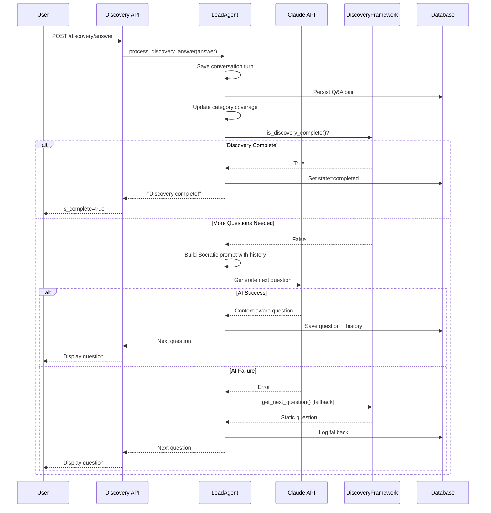

# Socratic Discovery Methodology

This document describes the AI-powered Socratic questioning system used during the discovery phase of project requirements gathering.

## Overview

The discovery phase transforms from static template-based questions to fully AI-driven Socratic questioning. Instead of presenting a fixed list of questions, the system generates context-aware follow-up questions that build on the user's previous answers, creating a more natural and effective requirements gathering experience.

## Key Features

### 1. Dynamic Question Generation

Each question after the first is generated by Claude using:
- Full conversation history (all previous Q&A pairs)
- Category coverage analysis (which topics still need discussion)
- Socratic method principles (probing deeper, clarifying vague answers)

### 2. Category Coverage Tracking

The system tracks coverage of five core categories:
- **problem**: What problem the application solves
- **users**: Who the target users are
- **features**: What features are required
- **constraints**: Technical and business constraints
- **tech_stack**: Preferred technologies and tools

Each category is marked as:
- `uncovered`: No relevant answers yet
- `covered`: Category adequately addressed

### 3. Conversation History Persistence

All Q&A pairs are persisted to the database, enabling:
- Session continuity across restarts
- Full context for PRD generation
- Audit trail of discovery decisions

### 4. Graceful Fallback

If AI generation fails, the system falls back to static framework questions, ensuring discovery can always progress.

## Architecture

```
┌─────────────────────────────────────────────────────────────┐
│                    LeadAgent                                 │
├─────────────────────────────────────────────────────────────┤
│ _discovery_conversation_history: List[Dict[str, str]]        │
│ _category_coverage: Dict[str, str]                           │
│ discovery_mode: str  # 'dynamic', 'static', 'hybrid'         │
│ MIN_DISCOVERY_QUESTIONS: int = 5                             │
│ MAX_DISCOVERY_QUESTIONS: int = 20                            │
├─────────────────────────────────────────────────────────────┤
│ start_discovery()           -> str                           │
│ process_discovery_answer()  -> str                           │
│ _generate_next_discovery_question() -> Optional[str]         │
│ _build_discovery_question_prompt()  -> str                   │
│ _get_category_coverage()    -> Dict[str, str]                │
│ _save_conversation_turn()   -> None                          │
└─────────────────────────────────────────────────────────────┘
                          │
                          │ uses
                          ▼
┌─────────────────────────────────────────────────────────────┐
│              DiscoveryQuestionFramework                      │
├─────────────────────────────────────────────────────────────┤
│ Serves as fallback/validation                                │
│ Provides completion detection                                │
│ Defines required categories                                  │
└─────────────────────────────────────────────────────────────┘
```

## Discovery Flow



## Configuration

### Discovery Mode

Set via the `discovery_mode` attribute (default: `dynamic`):

- **dynamic**: All questions generated by AI
- **static**: Use only framework questions (fallback behavior)
- **hybrid**: Start with framework, switch to AI for follow-ups

### Question Limits

- `MIN_DISCOVERY_QUESTIONS`: Minimum questions before completion (default: 5)
- `MAX_DISCOVERY_QUESTIONS`: Maximum questions to prevent infinite loops (default: 20)

## Prompt Engineering

The Socratic prompt template (`_build_discovery_question_prompt`) includes:

1. **System context**: Role as requirements analyst using Socratic method
2. **Conversation history**: All previous Q&A pairs formatted as numbered turns
3. **Uncovered categories**: Topics still needing discussion
4. **Socratic guidelines**: Instructions for generating context-aware questions

Example prompt structure:
```
You are a skilled requirements analyst gathering information for a software project using the Socratic method.

## Previous Conversation
Q1: What problem does your app solve?
A1: Weather tracking for sailors

Q2: Who are the primary users?
A2: Commercial fishing boat operators

## Topics Still to Cover
The following areas haven't been discussed yet: features, constraints, tech_stack

## Guidelines for Your Question
- Ask exactly ONE question
- Reference specific details from previous answers when relevant
- If the user mentioned something interesting, probe deeper
- Keep the tone conversational and helpful

Generate your next question:
```

## Database Storage

Conversation data is stored in the `memory` table using the `discovery_state` category:

| Key Pattern | Value | Description |
|-------------|-------|-------------|
| `state` | `idle`/`discovering`/`completed` | Current discovery state |
| `current_question_id` | `ai_generated_N` or framework ID | Current question identifier |
| `current_question_text` | Question text | Actual question being asked |
| `conversation_turn_N` | JSON `{question, answer}` | Complete Q&A history |
| `category_coverage` | JSON coverage map | Category status tracking |

## Error Handling

### AI Generation Failure

When AI question generation fails:
1. Log warning with error details
2. Fall back to `DiscoveryQuestionFramework.get_next_question()`
3. Continue discovery without interruption

### Database Errors

- Conversation turns are saved to in-memory list even if DB save fails
- Discovery can continue with partial persistence
- Errors logged for monitoring

## Testing

Test coverage for Socratic discovery is in:
- `tests/agents/test_lead_agent_socratic_discovery.py` (31 tests)

Key test categories:
- Conversation history tracking
- AI-powered question generation
- Category coverage tracking
- Dynamic question processing
- Fallback mechanisms
- Discovery completion logic
- Prompt engineering
- Configuration options
- Integration tests

## Example Session

```
User: Creates project "Weather App for Sailors"

AI Q1: What specific problem does your weather app solve for sailors?
User: Provides offshore weather alerts to avoid dangerous conditions

AI Q2: You mentioned offshore conditions - what specific weather data
       do sailors need most urgently for safety decisions?
User: Wind speed, wave height, and storm tracking

AI Q3: For commercial fishing boats, how far in advance do operators
       typically need weather forecasts to plan their routes?
User: At least 3-5 days for trip planning

AI Q4: What technical constraints should we consider - do these boats
       have reliable internet connectivity offshore?
User: No, they need offline capability with periodic sync

[... continues until all categories covered ...]

AI: Discovery complete! All required questions have been answered.
```

## Troubleshooting

### Questions seem generic

- Check that conversation history is being saved correctly
- Verify category coverage is updating after answers
- Review prompt template in `_build_discovery_question_prompt()`

### Discovery never completes

- Ensure answers map to framework question IDs
- Check `is_discovery_complete()` logic in DiscoveryQuestionFramework
- Verify `MAX_DISCOVERY_QUESTIONS` limit isn't set too high

### AI questions failing frequently

- Check API key and Claude API availability
- Review error logs for specific failure reasons
- Consider switching `discovery_mode` to `hybrid` or `static`

## Future Improvements

1. **Adaptive questioning depth**: Adjust follow-up depth based on answer complexity
2. **Multi-language support**: Detect and match user's language in questions
3. **Domain-specific templates**: Pre-load domain knowledge for specialized projects
4. **Question quality scoring**: Rate AI-generated questions and learn from feedback
